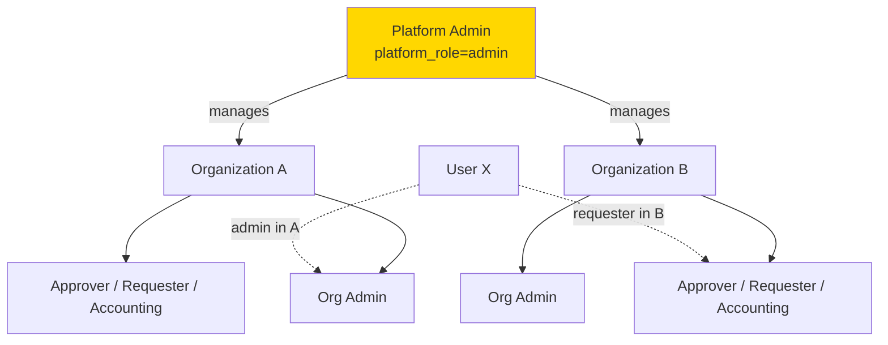
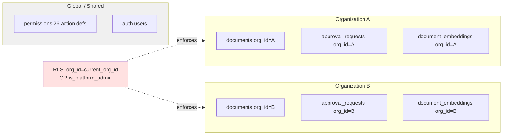

# Multi-Tenant Architecture Proposal (Final)

**Author:** Dzikri
**Date:** 2026-04-05
**Status:** Final — pending sign-off (see §13)
**Issue:** [#127](https://github.com/oct-path/github.com/oct-path/EB-FILEMG/issues/127)
**Supersedes:** `docs/farhan/multi-tenant/multi-tenant-proposal.md`, `docs/farhan/multi-tenant/multi-tenant-architecture-plan.md`, `docs/farhan/multi-tenant/multi-tenant-addendum.md`
**Companion docs:**
- [`multi-tenant-high-level-overview.md`](./multi-tenant-high-level-overview.md) — High-level overview: onboarding SOP, custom domains, role model summary, bad-actor mitigation, QA test matrix
- [`multi-tenant-implementation-details.md`](./multi-tenant-implementation-details.md) — All SQL migrations, TypeScript code, RLS policies, triggers, and service-layer implementations

> **Decision pending (§14 #5):** This document was written assuming **per-org permission matrix customization** (Option B in overview §6). If Endo-san approves **Option A (global matrix)**, the following sections need adjustment: §1 overview table, §5 Migration 4 table count (17→16, remove `role_permissions`), §5 Migration 5 step 6, §5 Migration 11, §9 permission.ts service change, §12 risk row on permission backfill, §13 Phase 2 item 13. See overview §6 for the full comparison.

---

## 1. Overview

EB-FILEMG currently operates as a **single-tenant system** — all users share a global namespace with user-level RLS (`user_id = auth.uid()`). This proposal introduces **multi-tenant architecture**: each organization (company/team) has its own isolated workspace, while sharing the same application, database, and S3 bucket.

The model is **row-level multi-tenancy**: one PostgreSQL database, one Supabase project, an `org_id` column on every data table, and RLS policies that scope every query to the caller's current organization.

### Why multi-tenant?

| Today | With multi-tenant |
|---|---|
| Single shared workspace | Each org has isolated data |
| One approval-route set for everyone | Per-org approval workflows |
| Single permission matrix | Per-org permission customization |
| One set of departments/positions | Per-org departments/positions |
| Cannot onboard multiple companies | Unlimited independent tenants |
| No data separation | Strict DB-enforced isolation |

---

## 2. Role Model

Two-tier role model:

```
Platform Admin (system-wide)
  └── Organization A
        ├── Org Admin
        ├── Approver
        ├── Requester
        └── Accounting
  └── Organization B
        ├── Org Admin
        ├── ...
```

- **`platform_role`** (`'admin' | 'user'`) — stored on `profiles`, system-wide.
- **Org role** (`'admin' | 'approver' | 'requester' | 'accounting'`) — stored per row in `organization_members`.
- A user **can belong to multiple orgs** with different roles in each.
- The **active org** is determined by the URL slug (`/[slug]/...`).

### User impact

- **Regular users (Requester / Approver / Accounting)** — after login, select org (or auto-redirect if only one). URLs change from `/files` → `/{org-slug}/files`.
- **Organization Admin** (new role) — per-org admin; manages users, approval routes, departments, positions, permissions, activity logs *within their org only*.
- **Platform Admin** — replaces current `platform_admin`; operates above orgs; creates/manages all organizations; has a dedicated `/platform-admin/` dashboard.

### Migration of existing users

| Current role | New platform_role | New org role (in Default Org) |
|---|---|---|
| `platform_admin` | `admin` | `admin` |
| `admin` | `user` | `admin` |
| `approver` | `user` | `approver` |
| `requester` | `user` | `requester` |
| `accounting` | `user` | `accounting` |

**Zero data loss.** All existing rows get `org_id` = Default Organization UUID.

---

## 3. Isolation Strategy — Decision: Row-Level `org_id` (Option A)

Issue #127 requires a comparison of isolation options.

| Dimension | **Option A: `org_id` per row (chosen)** | Option B: Schema-per-tenant | Option C: DB-per-tenant |
|---|---|---|---|
| Isolation mechanism | RLS policies filter by `org_id` | Separate PG schemas | Separate Supabase projects |
| Query cost | One extra indexed predicate | None at query layer | None |
| Migration cost | One migration set for all orgs | N migration sets | N projects to manage |
| Connection pooling | Works (single schema) | Breaks pgbouncer multiplexing | N separate pools |
| pgvector / RAG | Native, shared indexes | Per-schema vector indexes | Cannot span tenants |
| Cross-org analytics | Simple `GROUP BY org_id` | UNION across N schemas | Federation required |
| New-tenant onboarding | `INSERT` + seed | Full DDL + seed | Provision project |
| **Blast radius of bug** | **High — one bad RLS = leak** | Medium | Low |
| Supabase feature compat | Full | Partial (realtime/auth assume one schema) | Full per project |
| Cost | Single DB plan | Single DB plan | N plans |
| Fit for EB-FILEMG | Dozens to low-hundreds of tenants | Breaks past ~50 schemas | Overkill |

### Why Option A

- **Supabase RLS was built for this.** Schema-per-tenant fights the framework.
- **pgvector / RAG.** `document_embeddings` and `submission_embeddings` share vector indexes — only row-level isolation allows this.
- **Migration sanity.** 50+ existing migrations; Option B would 10x future migration complexity.
- **Pooling.** Schema-per-tenant breaks pgbouncer transaction mode (Supabase's default).
- **Scale fit.** EB-FILEMG targets Japanese SMBs (tens of tenants). Option A scales to hundreds comfortably.

**Accepted risk:** A single bad RLS policy can leak across tenants. Mitigated by the test harness (§11).

**When we'd revisit:** regulated-industry tenants with physical isolation requirements, per-tenant data-residency, or >500 tenants. None on roadmap.

---

## 4. Tenant-Context Propagation — Decision: JWT Custom Claims

**This is a change from the earlier architecture plan.** The previous plan chose PostgreSQL session variables alone; we are moving to **JWT custom claims as the primary mechanism**.

### Why the change

The session-variable approach had a known-risky dependency on pgbouncer transaction-pooling behavior: `set_config(..., false)` (session-scoped) does **not** reliably persist across supabase-js `.rpc()` / `.from()` calls, because PostgREST + pgbouncer transaction mode may route each statement to a different backend.

### Approach

1. **Supabase `custom_access_token_hook`** writes these into every issued JWT:
   - `active_org_id` — the org the user is currently acting in
   - `platform_role` — `'admin' | 'user'`
   - `active_org_role` — `'admin' | 'approver' | 'requester' | 'accounting'`
2. RLS policies read via helpers that call `auth.jwt() ->> 'active_org_id'` etc.
3. **Next.js middleware** validates the URL `{slug}` against the JWT's `active_org_id`. Mismatch → 403.
4. **Org switching** calls a server action that updates the user's "active org" flag, then `supabase.auth.refreshSession()` to rotate the JWT.
5. **Fresh-membership guarantee** (handles JWT staleness): a short-lived (e.g. 5 min) `active_org_role` means revocation takes at most one refresh cycle. For the sensitive invariants, server actions additionally re-verify membership against `organization_members` at the start of privileged operations.

### Trade-offs accepted

| Concern | JWT claim (chosen) | Session vars (rejected) |
|---|---|---|
| Per-request setup cost | Zero — claim is in token | One RPC per request |
| Pooling compatibility | Works (stateless) | Risky under transaction pooling |
| Org switch cost | JWT refresh (~1 round-trip) | Zero |
| Multi-tab same user | Requires careful handling | Clean per-request |
| Stale membership | Up to refresh-TTL stale | Always fresh |
| Server-action discipline | Transparent | High — every action must call `getSessionContext()` |
| Debugging | Decode JWT to inspect | Session vars visible in `current_setting` |

**Stale-role mitigation:** for privileged mutations (member management, permission matrix edits, approval routing changes), server actions double-check the `organization_members` row *in the same transaction* as the write. This removes the stale-JWT window for all blast-radius operations.

### `getSessionContext()` is still the choke point

Every server action that touches org-scoped data must call `getSessionContext(orgSlug)` first. It:
1. Calls `supabase.auth.getUser()` (validates the JWT signature via Supabase Auth).
2. Resolves URL `orgSlug` → `org_id` (cached per-request).
3. Verifies the JWT's `active_org_id` matches the resolved `org_id` (or caller is platform admin).
4. Returns `{ supabase, user, orgId, orgSlug, orgRole, isPlatformAdmin }`.

Freshness is split by blast radius:

| Operation class | Freshness mechanism |
|---|---|
| Reads (list documents, fetch request, etc.) | JWT claim only. Stale by up to the 5-min TTL (§14 #10). Acceptable. |
| Ordinary writes (create document, edit request) | JWT claim + RLS `WITH CHECK`. RLS rejects if membership row was deleted. |
| Privileged mutations (member invite, role change, permission edit) | **Must call `getSessionContext({ verifyMembership: true })`** — re-reads `organization_members` in the same request. |

The list of privileged mutations is enumerated in `src/service/**/privileged-actions.md`.

### Lint enforcement

**Custom ESLint rule `require-session-context`** — CI-blocking. Ensures every exported async function in `"use server"` files calls `getSessionContext(...)` before any `supabase.from(...)`, `.rpc(...)`, or `.storage.*` call.

→ See [implementation-details.md §4](./multi-tenant-implementation-details.md#4-tenant-context-propagation--lint-enforcement) for full rule specification.

---

## 5. Database Schema — Migrations Overview

All SQL code is in → [implementation-details.md §5](./multi-tenant-implementation-details.md#5-database-schema--migration-sql).

### Migration 1 — `organizations` table

Creates the `organizations` table with `name`, `slug` (unique, format-checked), `settings` (jsonb), `is_active`. Includes a **reserved-slug CHECK constraint** preventing collisions with static routes (`login`, `platform-admin`, `api`, `_next`, etc.).

### Migration 2 — `organization_members` table

Creates `organization_members` with `org_id`, `user_id`, `role` (enum: admin/approver/requester/accounting), `is_active`, and **per-membership profile fields** (`first_name`, `last_name`, `department_id`, `position_id`). Unique constraint on `(org_id, user_id)`.

### Migration 3 — `platform_role` on `profiles`

Adds `platform_role` enum (`'admin' | 'user'`) column to `profiles`.

### Migration 3b — Move profile fields onto `organization_members`

Backfills `first_name`, `last_name`, `department_id`, `position_id` from `profiles` into `organization_members` for Default Org. Drops `department_id`/`position_id` from `profiles`. This is necessary because departments and positions become org-scoped — a user in multiple orgs can't carry a single global `department_id`.

### Migration 4 — `org_id` on all data tables

Adds `org_id uuid NOT NULL REFERENCES organizations(id) ON DELETE RESTRICT` to 17 tables: `documents`, `folders`, `document_embeddings`, `ai_threads`, `ai_messages`, `approval_requests`, `approval_routes`, `approval_route_steps`, `approval_request_step_approvals`, `approval_request_documents`, `submission_embeddings`, `activity_logs`, `departments`, `positions`, `role_permissions`, `notifications`, `category_types`.

**`ON DELETE RESTRICT`** — org deletion is a soft-delete flow. Hard-delete is Phase 3.

**Not added to:** `permissions` (global read-only seed — 26 action definitions), `profiles` (users are multi-tenant via `organization_members`).

**Composite indexes** on each table matching the dominant query pattern (e.g., `(org_id, user_id)`, `(org_id, created_at DESC)`, `(org_id, status)`).

### Migration 5 — Seed default org + backfill

1. Insert Default Organization (fixed UUID).
2. Map existing users → `organization_members` rows with mapped org roles (table in §2).
3. Set `platform_role` for current `platform_admin` users.
4. Ensure every platform admin has an `organization_members` row (seed into Default Org as admin if missing).
5. Backfill `org_id = <default_uuid>` on all data tables.
6. Copy existing `role_permissions` rows into default org.
7. Set `profiles.settings.active_org_id = <default_uuid>` for all existing users.
8. Set `org_id` NOT NULL on all data tables.

### Migration 5b — Default Organization deletion guard

Adds `is_default boolean` column to `organizations`. The Default Organization is **non-deletable** (protected by DB trigger) but **renamable** (name and slug can be changed). Rationale: platform admins need a guaranteed home org for Migration 7's write trigger to function. Same principle as `prevent_last_platform_admin_removal`.

### Migration 6 — Helper functions (read JWT claims)

Five `STABLE` SQL functions that read JWT claims: `current_org_id()`, `is_platform_admin()`, `current_org_role()`, `is_org_admin()`, `is_org_admin_of(p_org_id)`. The last is `SECURITY DEFINER` to avoid `organization_members` RLS recursion.

### Migration 7 — Auto-set `org_id` trigger (with spoofing protection)

`BEFORE INSERT` trigger on all 15 scoped tables. **Fails closed** three ways:
- Missing JWT `active_org_id` → exception.
- Client passes `org_id` that doesn't match JWT → exception (not silently overwritten).
- Sets `org_id` from JWT on every INSERT.

**Platform-admin writes** require explicit context switching via `switchActiveOrgAs(orgId, reason)` — a logged impersonation path that writes to `platform_activity_logs` before updating the active org. Normal `switchActiveOrg(orgId)` does not require a reason.

### Migration 8 — Rewrite RLS policies

**Core pattern:** every policy starts with `is_platform_admin() OR (org_id = current_org_id() AND ...)`.

- Platform admins bypass org scoping on reads.
- `organization_members` policies use the SECURITY-DEFINER `is_org_admin_of()` helper to avoid infinite recursion.
- `organizations` table: members can SELECT their own orgs; all management ops require platform admin.
- Full policy set: 16 tables x SELECT/INSERT/UPDATE/DELETE = ~60 policies.

### Migration 8b — Cross-table same-org invariant triggers

Write-time guards preventing cross-org foreign key references. E.g., `approval_request_documents` must have request + document in the same org. Applied to 7 join-table relationships. Complements the §11.3 invariant monitor.

### Migration 9 — Embedding RPCs

Adds `p_org_id uuid` parameter to all SECURITY DEFINER embedding functions. They bypass RLS and must filter explicitly. Applies to: `match_document_embeddings` (all versions), `match_submission_embeddings`, `hybrid_search_bm25_v4`, `check_user_permission`.

### Migration 10 — `handle_new_user` trigger

Updated to create `organization_members` row only if `org_id` is in the invite metadata. Signup-without-invite leaves user orgless (UI prompts them to join).

Also adds `clear_stale_active_org` trigger: when a user is removed/deactivated from their active org, clears `profiles.settings.active_org_id` immediately (belt-and-suspenders with the JWT hook's stale-membership guard).

**Invite-existing-user path:** when `inviteUserByEmail` returns "already registered", the service falls back to direct `organization_members` INSERT + in-app notification.

### Migration 11 — `check_user_permission` RPC

Rewritten to be org-scoped: filters `role_permissions` by `current_org_id()` and `current_org_role()`.

### Migration 12 — `platform_activity_logs`

Dedicated audit table for platform-admin and RLS-bypassing operations. Separate from org-scoped `activity_logs` because some rows have `org_id = null` (cross-org events). Platform-admin-only SELECT policy.

---

## 6. Custom Access Token Hook (JWT claim injection)

A PostgreSQL function `custom_access_token_hook` that injects `active_org_id`, `platform_role`, and `active_org_role` into every JWT issued by Supabase Auth. Includes a **stale-membership guard** (nulls `active_org_id` if the user is no longer an active member of that org) and **fail-open exception handling** (returns original claims on error rather than blocking all logins).

Requires manual enablement in Supabase Dashboard → Authentication → Hooks (one-time per environment).

Claims are written to the **JWT top-level**, not `app_metadata`/`user_metadata`. Server-side reading requires `jwtDecode()` on the access token. RLS reads via `auth.jwt()`.

→ See [implementation-details.md §6](./multi-tenant-implementation-details.md#6-custom-access-token-hook-jwt-claim-injection) for full SQL, grants, and TypeScript code.

---

## 7. S3 Storage Isolation

### Path convention

`uploads/{org_id}/{user_id}/{uuid}_{filename}`

### Supabase Storage RLS

Storage RLS policy uses `(storage.foldername(name))[2]` (PostgreSQL 1-indexed arrays) to match `org_id` segment. Platform admins bypass; regular users scoped to `current_org_id()`.

→ See [implementation-details.md §7](./multi-tenant-implementation-details.md#7-s3-storage-isolation--rls-policy) for full SQL.

**Signed-URL generation must verify the object prefix matches `current_org_id()`** in server code before returning a URL.

### Supabase Realtime

Realtime subscriptions respect RLS via the JWT sent on channel connect. Custom claims propagate. After `switchActiveOrg` + `refreshSession`, the client must **reconnect** the Realtime channel (add a `session` listener that re-subscribes on `TOKEN_REFRESHED`).

### Off-boarding / tenant deletion

- `organization_members` cascades automatically.
- Data tables are **soft-deleted** (org `is_active = false`) in Phase 2. Hard-delete + S3 cleanup is Phase 3.
- Orphaned users see "No organizations — contact admin."

---

## 8. Type Definitions

New `src/types/organization.ts` defines `Organization`, `OrgRole`, `PlatformRole`, and `OrganizationMember` interfaces.

Updated types across `user.ts`, `permission.ts`, `department.ts`, `position.ts`, `notification.ts` — adding `org_id` fields and removing profile-level fields that moved to `OrganizationMember`.

→ See [implementation-details.md §8](./multi-tenant-implementation-details.md#8-type-definitions) for full TypeScript interfaces.

---

## 9. Service Layer Pattern

### Required changes

Every org-scoped server action:

1. Starts with `"use server"`.
2. Accepts `orgSlug: string` as the first parameter.
3. Calls `getSessionContext(orgSlug)` first.
4. Uses `orgRole` / `isPlatformAdmin` from context for authorization.
5. Returns `{ data, error }`.

### Service files to modify

| File | Change |
|---|---|
| `src/service/auth/authorization.ts` | Replace `isAdminOrSuper()` with `isOrgAdmin()` / `isPlatformAdmin()`. Org-scoped `checkPermission()`. |
| `src/service/admin/user.ts` | Org-scoped user management; `inviteUser` passes `org_id` in metadata. |
| `src/service/admin/permission.ts` | Org-scoped permission matrix. |
| `src/service/admin/department.ts` | Org-scoped departments. |
| `src/service/admin/position.ts` | Org-scoped positions. |
| `src/service/approvalRequest/approvalRequest.ts` | All exports take `orgSlug`. |
| `src/service/approvalRequest/approvalRouteMatching.ts` | Org-scoped. |
| `src/service/approvalRoute/approvalRoute.ts` | Org admin check; `orgSlug` param. |
| `src/service/activityLog/activityLog.ts` | `logActivity()` uses org_id from context. |
| `src/service/notification/notification.ts` | Org-scoped. |
| `src/service/document/document.ts`, `folder.ts`, `thread.ts`, `message.ts` | Add `orgSlug` param. |
| `src/service/user.ts` | `getCurrentUser()` returns `platform_role` + org memberships list. |
| `src/service/rag/submissionEmbeddings.ts` | Pass `p_org_id` to embedding RPCs. |
| `src/service/s3/uploadFile.ts` | S3 key: `uploads/{org_id}/{user_id}/...`. |
| `src/app/api/upload/route.ts`, `src/app/api/openai/respond/route.ts`, `src/app/api/folders/*`, `src/app/api/files/*` | Add org context resolution. |

### New service: `src/service/organization/organization.ts`

Platform-admin-only CRUD:
- `getOrganizations()` — list all
- `createOrganization({ name, slug, seedDefaults? })` — create + optionally seed default departments/positions/role_permissions (seedDefaults defaults to `true`; see overview §1 for the toggle)
- `updateOrganization(id, patch)` — update settings/active flag
- `getOrganizationMembers(orgSlug)` — list members
- `inviteMemberToOrg(orgSlug, email, role)` — invite
- `updateMemberRole(orgSlug, userId, role)` — change role
- `removeMember(orgSlug, userId)` — remove
- `switchActiveOrg(orgId)` — updates `profile.settings.active_org_id`, client must `refreshSession()` after

### 9.1 Per-request slug → org_id cache

Uses React's `cache()` (request-scoped) so all server actions within one render share the slug → org_id lookup.

### 9.2 Service-role callers (webhooks, cron, external APIs)

Any caller without a user JWT bypasses RLS entirely. Must use `withOrgScope(orgId, fn)` wrapper that validates the org, asserts acting-user membership if claimed, and writes an audit row to `platform_activity_logs`. Callers must write explicit `.eq('org_id', orgId)` filters on every query.

**Enforcement:** lint rule `no-raw-service-role` forbids direct `createClient(SUPABASE_URL, SERVICE_ROLE_KEY, ...)` outside the wrapper files.

### 9.3 First-login / no-active-org flow

1. Root `/` page reads the user's `organization_members` list server-side.
2. If **0 memberships** → "No organizations — contact admin."
3. If **1 membership** → auto-switch + redirect to `/{slug}/`.
4. If **≥ 2 memberships** → org picker.
5. Middleware permits `active_org_id = null` only on `/`, `/login`, `/inactive`, `/auth/*`.

→ See [implementation-details.md §9](./multi-tenant-implementation-details.md#9-service-layer--code) for all TypeScript code.

---

## 10. Routing & UI

### URL structure

```
/                                    → Org selector / auto-redirect
/login, /inactive, /auth/*           → unchanged
/[slug]/                             → Dashboard
/[slug]/files
/[slug]/c, /[slug]/c/[threadId]
/[slug]/approval-requests/[id]
/[slug]/activity-log
/[slug]/admin/users
/[slug]/admin/approval-routes
/[slug]/admin/departments
/[slug]/admin/positions
/[slug]/admin/permissions
/platform-admin/                     → NEW
/platform-admin/organizations
/platform-admin/organizations/[id]
```

`[slug]` is top-level dynamic — static routes (`login`, `platform-admin`, `api`, etc.) resolve first. The reserved-slug constraint in Migration 1 prevents org-slug collisions.

### Next.js middleware

Validates session and org-slug access at the edge. Decodes JWT (no signature verification — UX gating only) to check `platform_role` and `active_org_id`. Platform admins can access any slug; regular users without `active_org_id` redirect to org picker.

**Trust boundary note:** The middleware is UX gating, not the security boundary. Every server action validates the token via `supabase.auth.getUser()` inside `getSessionContext`.

→ See [implementation-details.md §10](./multi-tenant-implementation-details.md#10-routing--ui--code) for middleware TypeScript code.

### `src/app/[slug]/layout.tsx`

Server component — resolves slug → org, verifies membership, renders `OrgProvider`.

### `src/providers/OrgProvider.tsx`

Provides `{ org, orgSlug, orgRole, isPlatformAdmin }` via React context. TanStack Query hook for membership uses `staleTime: 60_000` + `refetchOnWindowFocus: true`.

### Org switcher

Calls `switchActiveOrg(orgId)` → `supabase.auth.refreshSession()` → `router.push("/{new-slug}/")`. Cache is invalidated on slug change.

### Multi-tab sync

`BroadcastChannel('org-sync')` broadcasts org switches to other tabs, which call `refreshSession` and re-route. **This is a UX nicety, not a security control.** Real backstops:

1. **Ordinary writes** — RLS `WITH CHECK (org_id = current_org_id())` rejects mismatches.
2. **Privileged mutations** — `getSessionContext({ verifyMembership: true })` re-reads membership.

### Slug rename

- `organization_slug_aliases` table stores old slugs permanently.
- New slugs must not collide with existing slugs OR existing aliases.
- Middleware 301-redirects old slugs to canonical slug.
- **Aliases are permanent** — removed only when org is hard-deleted (CASCADE).

### Platform-admin UI

- `/platform-admin/` — dashboard: org count, user count, recent activity.
- `/platform-admin/organizations` — table + `CreateOrganizationDialog`.
- `/platform-admin/organizations/[id]` — edit settings, manage members, toggle active.

---

## 11. Testing Strategy — Cross-Tenant Leakage Harness

### 11.1 pgTAP SQL tests

**Fixture:** Org A + Org B, one user each per org role (5 roles x 2 orgs = 10 users), 3 documents per table x org.

**Generated matrix:** 16 tables x 2 orgs x 5 roles x 4 CRUD ops = ~**640 assertions**. Generator script walks the schema rather than hand-writing each.

8 assertion types per table covering SELECT isolation, INSERT spoofing rejection, UPDATE/DELETE cross-org denial, and trigger auto-population. Plus RPC-specific assertions for all SECURITY DEFINER functions.

### 11.2 Playwright E2E (`e2e/multi-tenant-isolation.spec.ts`)

1. UI leakage — Alice cannot navigate to `/org-b/files/<org-b-doc-id>`.
2. API leakage — direct fetch with Alice's session + Org-B IDs returns empty/error.
3. URL manipulation — change URL from `/org-a/files` to `/org-b/files` → denied.
4. Org switcher — multi-org user switches orgs, previous org's data disappears.
5. Stale tab — user revoked from Org A in tab 1, tab 2 attempts action, gets denied.
6. Upload isolation — Alice's session cannot read Org-B S3 prefix via signed URL.
7. RAG isolation — Alice's chat query cannot surface Org-B embeddings.
8. Signed URL forgery — guessed path → server rejects.

### 11.3 Continuous invariant monitor

`public.leakage_invariant_check()` runs hourly via pg_cron, alerts on cross-org reference violations across 5 relationship types.

### 11.4 CI gate

pgTAP → Playwright → invariant check → query-plan regression suite. All must pass before merge.

### 11.5 Query-plan regression suite

EXPLAIN-based guards ensuring composite indexes are used and no `Seq Scan` occurs on org-scoped tables. Allow-list of ~15 hot queries, snapshot-tested.

**Phase 2 cannot ship to staging until:** all ~640 pgTAP assertions pass, all 8 Playwright scenarios pass, invariant monitor returns 0, and manual penetration test is completed.

→ See [implementation-details.md §11](./multi-tenant-implementation-details.md#11-testing--implementation-details) for pgTAP fixture details, CI yaml, and invariant SQL.

---

## 12. Risk Assessment

| Risk | Severity | Mitigation |
|---|---|---|
| **RLS policy bug → cross-tenant leak** | Critical | Test harness (§11). CI-blocked by 640+ assertions. Invariant monitor in prod. |
| **JWT claim staleness after role revocation** | High | Short token TTL; privileged mutations re-check `organization_members` in same transaction. |
| **Forgotten `getSessionContext()` in a new server action** | High | ESLint rule in CI. RLS fails-closed (zero rows) if bypassed. |
| **Trigger spoofing (client passes wrong org_id)** | High | Trigger raises exception on mismatch (Migration 7). |
| **organization_members RLS recursion** | Medium | SECURITY DEFINER helper `is_org_admin_of()` (Migration 6). |
| **Storage bucket bypass (S3 direct access)** | Medium | Supabase Storage RLS policy on `storage.objects`; server-side prefix check on signed-URL generation. |
| **URL slug collision with static routes** | Medium | CHECK constraint reserved-slug list (Migration 1). |
| **Performance regression from org_id predicate** | Low | Composite indexes `(org_id, ...)` sized for actual query patterns (Migration 4). |
| **Migration reversibility** | Medium | All Migration 1–7 are additive. Migration 8 (RLS rewrite) + service layer deploy together as big-bang, with rollback plan §14. |
| **User confusion on first login** | Low | Single-org users auto-redirect; multi-org users see picker; docs + in-app tour. |
| **Realtime channel using stale JWT after org switch** | Medium | Client re-subscribes on `TOKEN_REFRESHED` event; Playwright scenario added. |
| **Service-role callers bypass RLS** | High | `withOrgScope(orgId, fn)` wrapper; lint flag on direct service-role `.from()` calls. |
| **Per-tenant backup/restore not natively supported** | Medium | Documented limitation; row-level only. Logical export script per-org as Phase 3. |
| **New global permission not seeded into existing orgs** | Medium | Permission additions must ship with backfill migration inserting `role_permissions` for all orgs. |
| **Loss of last platform admin (lockout)** | High | `prevent_last_platform_admin_removal` trigger + service-layer guard. |
| **Cross-table FK allows cross-org references** | High | Write-time `assert_same_org` triggers on join tables (Migration 8b). Invariant monitor catches drift. |
| **Per-org department/position mismatch for multi-org users** | High | Moved `department_id`/`position_id` onto `organization_members` (Migration 3b). |
| **Invite fails when user already exists in auth.users** | Medium | Service falls back to direct `organization_members` INSERT + in-app notification. |
| **Slug rename breaks bookmarks / email links** | Medium | `organization_slug_aliases` table + 301 redirect in middleware. |
| **Multi-tab stale JWT after org switch** | Medium | `BroadcastChannel('org-sync')` triggers `refreshSession` in sibling tabs. |
| **`custom_access_token_hook` exception blocks all logins** | High | Hook has top-level `EXCEPTION WHEN OTHERS` — returns original claims on failure. |
| **Supabase email templates are global (no per-tenant branding)** | Low | Documented limitation; Phase 3+ if productized. |
| **Default Organization accidentally deleted → platform admin lockout** | High | `is_default` column + deletion guard trigger (Migration 5b). `is_default` flag cannot be changed via UPDATE. |

---

## 13. Scope — Phase 2 (April) vs Phase 3 (May+)

### Phase 2 (April, implementation window)

1. Migrations 1–12 including 5b (schema, RLS, helpers, triggers, RPCs, default org guard).
2. `getSessionContext()` + JWT custom-claims hook.
3. All RLS policies rewritten for org scoping.
4. Service layer — every server action takes `orgSlug`, calls `getSessionContext`.
5. Routing moved under `/[slug]/`.
6. `OrgProvider` + `useOrg` hook.
7. **Minimal** platform-admin UI: create org, invite first admin, list orgs.
8. Org switcher in sidebar.
9. Existing admin pages working under org scope.
10. Test harness (§11) wired into CI.
11. Custom ESLint rule enforcing `getSessionContext` call before `supabase.from(...)` in `"use server"` files (owner: Dzikri).
12. `prevent_last_platform_admin_removal` trigger on `profiles`.
13. Backfill-migration template for adding new global `permissions` rows into all orgs' `role_permissions`.

### Phase 3 (May+)

1. Full platform-admin dashboard: org metrics, bulk member management, active toggle, audit log.
2. Self-service org creation (if §14 decision allows).
3. Per-tenant branding / display preferences via `settings` jsonb.
4. Per-tenant notification channels (Slack, email per org).
5. Tenant-level SSO.
6. Usage metering / billing (if SaaS productization).
7. Cross-tenant analytics for platform admin.
8. Hard-delete background job + S3 cleanup for off-boarded tenants.
9. Per-tenant logical export script (point-in-time snapshot of one org's rows across all tables) for ad-hoc restore/offboarding.
10. Per-tenant rate limiting / query-budget enforcement (noisy-neighbor mitigation, especially for RAG queries).

### Out of scope (all phases, for now)

- Per-region data residency.
- Physical DB isolation per tenant.
- Tenant-owned encryption keys (BYOK).
- Per-tenant email template branding (Supabase Auth email templates are project-global).
- **Per-user data erasure inside an active tenant (GDPR/APPI "right to be forgotten").** Current scope handles tenant off-boarding (soft-delete in Phase 2, hard-delete + S3 scrub in Phase 3), but not per-user erasure while the tenant stays active. Revisit if a Japanese APPI or EU GDPR data-subject request arrives.

---

## 14. Open Decisions — Require Sign-Off Before Implementation

| # | Decision | Default recommendation | Approver |
|---|---|---|---|
| 1 | Default Organization name | "EB-FILEMG Main" (renamed to client name at go-live) | Product owner |
| 2 | Platform Admin user list | Current `platform_admin` holders → `platform_role = 'admin'` | Syahiid + Endo-san |
| 3 | Slug format | Auto-slugify from name, admin-editable, unique, reserved-list enforced | Syahiid |
| 4 | Self-service org creation | **No** in Phase 2 (platform admin only). Revisit Phase 3. | Product owner |
| 5 | New-org permission-matrix seed | **Pending decision — see overview §6.** Option A: global matrix (no seed needed, ~7–11 days total). Option B: per-org copy (130 rows per org, ~11–16 days total). Recommendation: Option A for Phase 2, Option B deferred to Phase 3. | **Endo-san** |
| 6 | New-org dept/position seed | Copy current 10 depts + 9 positions as defaults, editable | Syahiid |
| 7 | **Tenant-context mechanism** | **JWT custom claims** (this doc §4) | Syahiid + Endo-san |
| 8 | **Isolation option** | **Option A — row-level `org_id`** (§3) | Syahiid + Endo-san |
| 9 | **Platform-admin RLS pattern** | **Bypass via OR clause** (§5 Migration 8) | Syahiid |
| 10 | **JWT TTL for active_org_role** | **5 minutes** (balance UX vs stale-role window) | Syahiid |
| 11 | **Cutover strategy** | **Big-bang** (Migrations 1–11 + service rewrite deploy together to staging, 1-week soak, then prod) | Syahiid |
| 12 | **Rollback plan for prod leak** | Tighten-all emergency RLS policy (deny-by-default) + affected-row audit + incident notification + root-cause patch. See §15. | Syahiid + Endo-san |
| 13 | **Who can grant `platform_role = 'admin'`** | Existing platform admins only; must be logged to `platform_activity_logs` | Endo-san |
| 14 | **Composite-index allow-list + EXPLAIN snapshots** | Commit allow-list (~15 queries) + expected-index mapping before Migration 8 (RLS rewrite) merges. Owner: Dzikri | Syahiid |
| 15 | **Slug-alias retention** | **Permanent** (§10). Aliases removed only when org is hard-deleted. | Product owner |
| 16 | **Default Organization deletability** | **Non-deletable, renamable.** The Default Org is the platform admins' home base. Deletion is blocked by a service-layer guard + `is_default` column constraint. Renaming is allowed (e.g., "EB-FILEMG Main" → client's company name at go-live). Rationale: Migration 7's `set_org_id_from_jwt` trigger requires a non-null `active_org_id` for writes — if the default org is deleted and a platform admin has no other membership, they cannot write into any org. Same principle as `prevent_last_platform_admin_removal`: protect the thing that, if removed, bricks the system. See §5 Migration 5b. | Syahiid |

### Per-document review checklist

| Document | Syahiid (Lead Engineer) | Endo-san (PMO) | Dzikri |
|---|---|---|---|
| This proposal (high-level) | ☐ | ☐ | ✅ author |
| Implementation details | ☐ | ☐ | ✅ author |
| High-level overview | ☐ | ☐ | ✅ author |

---

## 15. Emergency Rollback Plan (Production Leak)

If cross-tenant leakage is detected post-deploy:

1. **Immediate (< 5 min):** deploy emergency RLS policy (`USING (false) WITH CHECK (false)`) to all data tables. Disables all access except service-role. Application returns maintenance page.
2. **Triage (< 30 min):** run `leakage_invariant_check()` + targeted audit queries; identify blast radius.
3. **Communicate (< 1 hour):** notify affected tenants per incident-comms policy.
4. **Patch:** fix RLS policy, deploy, remove emergency lock.
5. **Post-mortem:** root cause in this document's ADR log; add a pgTAP assertion that would have caught it.

→ See [implementation-details.md §15](./multi-tenant-implementation-details.md#15-emergency-rollback--sql) for emergency SQL.

---

## 16. Appendix — Architecture Diagrams

### Request flow

```mermaid
flowchart TD
    A[Browser: GET /acme-corp/files] --> B[Next.js middleware]
    B -->|Validates session| C{Authenticated?}
    C -->|No| D[Redirect /login]
    C -->|Yes| E[Route: /[slug]/files/page.tsx]
    E --> F[Server action: getFiles orgSlug]
    F --> G[getSessionContext orgSlug]
    G --> G1[supabase.auth.getUser]
    G --> G2[Resolve slug → org_id]
    G --> G3[Verify JWT active_org_id matches]
    G --> G4[Verify membership in organization_members]
    G4 --> H[supabase.from documents select]
    H --> I[RLS: is_platform_admin OR org_id=current_org_id AND ...]
    I -->|Denied| J[Return 0 rows]
    I -->|Allowed| K[Return scoped rows]
    K --> L[Render page]
    style G fill:#e1f5ff
    style I fill:#ffe1e1
```

### Role hierarchy



### Data isolation boundary



---

## Document Change Log

| Date | Author | Change |
|---|---|---|
| 2026-04-06 | Dzikri | **(aaa)** Final review: added "decision pending" callout blocks to all 3 docs noting which sections depend on Option A vs B; added `logPlatformActivity` helper (§9.2b) — was called but never defined; fixed `withOrgScope` env vars to use `process.env.*`; fixed `switchActiveOrg`/`switchActiveOrgAs` jsonb merge bug (was replacing entire `settings` object); added `update_profile_settings` RPC (Migration 10b) for safe jsonb merge. |
| 2026-04-06 | Dzikri | **(zz)** Scope creep mitigation: rewrote overview §6 from "per-org customization rationale" to a full Option A (global matrix, ~11–15 days) vs Option B (per-org, ~18–25 days) comparison with effort estimates, risk analysis, and upgrade path. Updated proposal decision #5 to pending Endo-san's approval. Updated QA test matrix §7 to reflect both options. Recommendation: Option A for Phase 2. |
| 2026-04-06 | Dzikri | **(yy)** Review fix: added `category_types` to Migration 4 table list in impl doc (17 tables); fixed Migration 2 FK ordering (`department_id`/`position_id` FKs deferred to post-Migration-4); added `updated_at` auto-update trigger (§12d); added `switchActiveOrg`/`switchActiveOrgAs` service code (§9.3); added `withPlatformAdminContext` wrapper specification (§9.4); added `createOrganization` with `seedDefaults` parameter (§9.5); updated proposal `createOrganization` signature to include `seedDefaults?`. |
| 2026-04-06 | Dzikri | **(xx)** Split document into high-level proposal + implementation details (`multi-tenant-implementation-details.md`). All SQL migrations, TypeScript code, RLS policy SQL, trigger code, and service-layer code moved to the implementation doc. High-level proposal retains all rationale, decisions, risk tables, scope, diagrams, and migration summaries with cross-references. |
| 2026-04-06 | Dzikri | **(ww)** Added §14 decision #16: Default Organization is non-deletable, renamable. Added Migration 5b with `is_default` column, unique index, deletion guard trigger, and flag-change guard trigger. Rationale: platform admins need a guaranteed home org for Migration 7's write trigger. |
| 2026-04-06 | Dzikri | **(vv)** Added companion doc `multi-tenant-high-level-overview.md` covering: tenant onboarding SOP, custom domain architecture (Vercel Custom Domains + Next.js middleware, not `vercel.json` rewrites), role model high-level summary, platform admin bootstrapping/lifecycle, bad-actor mitigation plan (compromised platform admin, compromised org admin, direct DB manipulation), `log_platform_role_change` audit trigger, per-org permission matrix customization rationale, seed strategy with Japan client perspective (default-on + opt-out toggle), QA/testing RBAC matrix. |
| 2026-04-05 | Dzikri | Fourth review pass (correctness + simplification): **(pp)** `custom_access_token_hook` now nulls `active_org_id` when the matching membership is missing/inactive (stale-membership guard); **(qq)** new `clear_stale_active_org` trigger; **(rr)** Migration 5 seeds platform admins into Default Org; **(ss)** Migration 12 `platform_activity_logs` defined; **(tt)** §4 simplified to ESLint-only enforcement; **(uu)** §9.2 `withOrgScope` simplified to explicit filters. |
| 2026-04-05 | Dzikri | Third review pass (gap-fill): **(ff)** ESLint rule specified concretely; **(gg)** reconciled membership re-check by blast radius; **(hh)** `withOrgScope` fully specified; **(ii)** Migration 5 backfills `active_org_id`; **(jj)** `switchActiveOrgAs` logged impersonation; **(kk)** BroadcastChannel documented as UX-only; **(ll)** slug aliases permanent; **(mm)** query-plan regression suite; **(nn)** GDPR/APPI out-of-scope; **(oo)** decisions #14, #15 added. |
| 2026-04-05 | Dzikri | Second review pass: **(t)** Migration 3b; **(u)** `ON DELETE RESTRICT`; **(v)** Migration 8b same-org triggers; **(w)** hook fail-open; **(x)** invite-existing-user; **(y)** slug aliases; **(z)** BroadcastChannel; **(aa)** middleware trust boundary; **(bb)** extended reserved slugs; **(cc)** platform-admin write distinction; **(dd)** email branding out-of-scope; **(ee)** risks added. |
| 2026-04-05 | Dzikri | Post-review fixes: **(k)** storage path index; **(l)** JWT decoding for claims; **(m)** auth grants; **(n)** Realtime isolation; **(o)** first-login flow; **(p)** slug cache; **(q)** `withOrgScope`; **(r)** Phase 2 scope additions; **(s)** new risks. |
| 2026-04-05 | Dzikri | Final consolidated proposal. Supersedes Farhan's 3-doc set. Key changes: **(a)** JWT custom claims; **(b)** trigger spoofing fix; **(c)** reserved-slug constraint; **(d)** `is_org_admin_of()` helper; **(e)** Storage RLS; **(f)** composite indexes; **(g)** `handle_new_user` guard; **(h)** `search_path` hardening; **(i)** platform-admin RLS bypass; **(j)** emergency rollback plan. |
