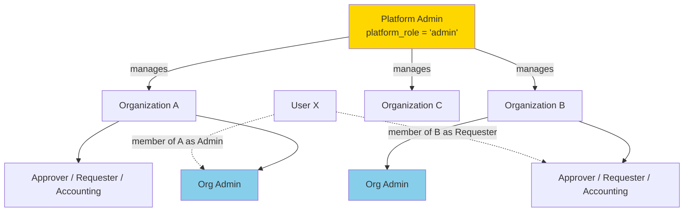
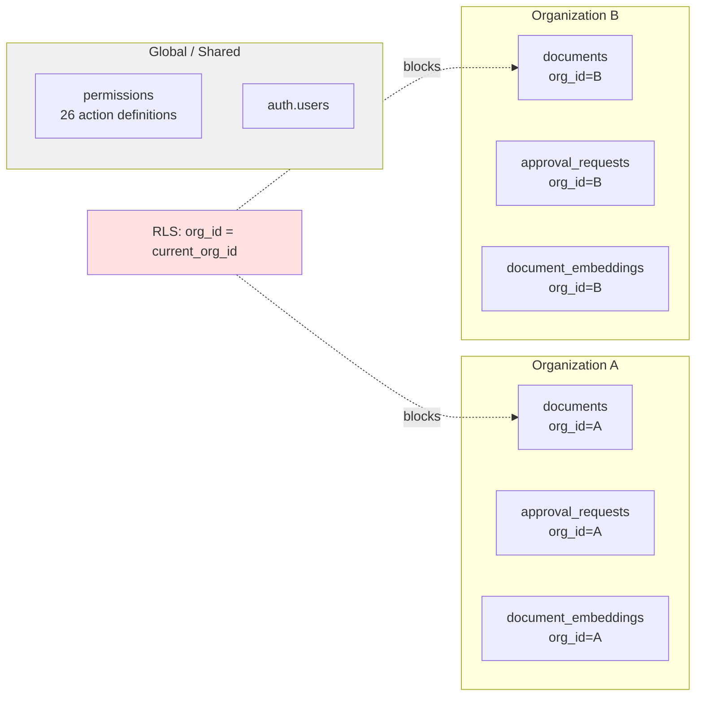

# Multi-Tenant Architecture — Addendum

**Author:** Dzikri
**Date:** 2026-04-05
**Companion to:** `multi-tenant-proposal.md` and `multi-tenant-architecture-plan.md` (Miftah)
**Issue:** [#127](https://github.com/oct-path/EB-FILEMG/issues/127)

---

## Purpose

The existing proposal and architecture plan cover most of the design. This addendum closes the remaining gaps against issue #127's acceptance criteria:

1. Isolation-strategy option comparison (A / B / C)
2. JWT custom-claims vs PostgreSQL session-variables trade-off
3. High-level architecture diagram
4. Project Phase 2 (April) vs Phase 3 (May+) scope mapping
5. Cross-tenant data-leakage test harness
6. Reviewer sign-off checklist

Nothing here overrides the architecture plan — it only supplements it.

---

## 1. Tenant Isolation Strategy — Options Compared

Issue #127 asks us to compare three approaches and justify the choice. The architecture plan picks row-level (`org_id`) but doesn't document *why*. Here is the comparison.

| Dimension | Option A: `org_id` per row (**chosen**) | Option B: Schema-per-tenant | Option C: Database-per-tenant |
|---|---|---|---|
| **Isolation mechanism** | RLS policies filter by `org_id` | Separate PG schemas, one per tenant | Separate Supabase projects |
| **Query cost** | One extra indexed predicate per query | None at query layer (schema scoped) | None (isolated DBs) |
| **Migration cost** | One set of migrations, applies to all orgs | N sets of migrations (one per schema) | N Supabase projects to manage |
| **Connection pooling** | Works (single schema, single DB) | Breaks — pgbouncer cannot multiplex across schemas cleanly | N separate pools |
| **pgvector compatibility** | Works natively | Works but each schema needs own vector index | Works, but RAG queries can't span tenants |
| **Cross-tenant analytics** | Simple (`GROUP BY org_id`) | Hard (UNION ALL across N schemas) | Very hard (federation) |
| **Onboarding a new tenant** | `INSERT INTO organizations` + seed default rows | Run full schema DDL + seed | Provision a new Supabase project |
| **Blast radius of bug** | **High** — single bad RLS policy leaks across tenants | Medium — schema boundary is a hard wall | Low — physical isolation |
| **Supabase feature compatibility** | Full (realtime, RLS, storage, edge functions) | Partial — realtime + auth assume single schema | Full, but auth/storage are per-project |
| **Cost** | One DB, one plan | One DB, one plan | N plans |
| **Fit for EB-FILEMG scale** | Dozens to low-hundreds of tenants | Breaks down past ~50 schemas | Overkill unless regulated enterprise |

### Recommendation: **Option A (row-level `org_id`)**

**Why:**
- **Supabase RLS is designed for this.** RLS was built for row-level multi-tenancy; schema-per-tenant fights the framework.
- **pgvector + RAG.** `document_embeddings` and `submission_embeddings` live in the same table; row-level filtering is the only option that keeps vector indexes sharable.
- **Migration simplicity.** We already have 50+ migrations. Option B would 10x migration complexity.
- **Connection pooling.** Option B breaks pgbouncer transaction mode, which is Supabase's default.
- **Expected scale.** EB-FILEMG targets Japanese SMBs (tens of tenants), not thousands. Option A scales comfortably to this size.

**Primary risk (accepted):** RLS-policy bug → cross-tenant leak. Mitigated by the test harness in §5.

**When would we revisit?** If we ever need (a) regulated-industry tenants requiring physical isolation, (b) data-residency guarantees per tenant, or (c) >500 tenants. None are on the roadmap.

---

## 2. JWT Custom Claims vs Session Variables

Issue #127 asks for "JWT custom claim + Next.js middleware." The architecture plan chose a different mechanism: PostgreSQL **session variables** set via `set_config('app.current_org_id', ...)` in a `getSessionContext()` helper called at the top of every server action. This is a legitimate architectural divergence and deserves a written trade-off so reviewers aren't surprised.

### The two approaches

**Approach 1 — JWT custom claim (what issue #127 suggested)**
- Supabase `custom_access_token_hook` database function writes `active_org_id` into every JWT at login/refresh
- RLS policies read `auth.jwt() ->> 'active_org_id'`
- Next.js middleware validates the URL `{slug}` against the JWT claim
- Switching orgs requires `supabase.auth.refreshSession()` to rotate the JWT

**Approach 2 — Session variables (what the plan chose)**
- `getSessionContext(orgSlug)` resolves slug → `org_id`, fetches membership, then calls `set_config('app.current_org_id', <uuid>)` + `app.platform_role` + `app.current_org_role`
- RLS policies read `current_setting('app.current_org_id')`
- Every server action must call `getSessionContext()` first
- Switching orgs is a no-op server-side (next request calls `getSessionContext` with new slug)

### Trade-off comparison

| Concern | JWT claim | Session variables (chosen) |
|---|---|---|
| **Per-request setup cost** | Zero — claim is in the token | One `set_config` RPC per request (or bundled into first query) |
| **Org switch cost** | JWT refresh round-trip | Zero — next request uses new slug |
| **Multi-tab / multi-org** | Problematic — one JWT per session, switching orgs in tab A affects tab B | Clean — each request carries its own slug, session vars are request-scoped |
| **Auth rotation safety** | Stale claim possible if membership revoked between refreshes | Always fresh — membership re-checked per request |
| **Server-action friendly** | Transparent (just read JWT) | Requires discipline: every action must call `getSessionContext()` first |
| **Edge-runtime compatible** | Yes (JWT is stateless) | Session vars work via Supabase RPC — also fine |
| **Auditability** | JWT is opaque to backend code | `getSessionContext()` is a single choke-point; easy to log/instrument |
| **Debugging** | Harder — must decode JWT | Easier — session vars visible in Postgres |
| **Risk: forgotten setup** | None | **High** — any server action that skips `getSessionContext()` runs with empty session, RLS denies everything (fails closed) |

### Why session variables is the right call for EB-FILEMG

- **Multi-org users are a stated requirement** (architecture plan §3). JWT rotation on every org switch adds friction; session vars handle per-request org context cleanly.
- **Stale-membership risk matters.** Platform admins can revoke an org membership; session vars re-verify every request. JWT would serve stale data until next refresh.
- **Fails closed.** If a developer forgets `getSessionContext()`, RLS returns zero rows. A forgotten JWT handler could silently use the wrong org.
- **Single choke point.** `getSessionContext()` is the one place where auth, org resolution, and session setup happen. Easier to audit than scattered JWT-reading code.

### Mitigations for the "forgotten setup" risk

The main downside (discipline required) needs concrete mitigations:

1. **Lint rule or codemod** — every file starting with `"use server"` must call `getSessionContext` before any `supabase.from(...)` call. Can be enforced by a custom ESLint rule.
2. **Integration test covering every server action** — call action without context, assert empty result (proves RLS is the enforcer, not the service code).
3. **`getSessionContext` returns the scoped supabase client** — makes bypass harder (you have to explicitly import `supabaseServer` to skip it).
4. **Runtime assertion in dev mode** — `supabaseServer()` wrapper checks session vars are set, logs a warning if not.

### Pooling caveat — must verify before implementation

**This is the single biggest technical risk in the session-variable approach and must be confirmed before Phase 2 kicks off.**

Supabase's default connection mode is pgbouncer **transaction pooling**. In transaction mode, each statement (or small group of statements) can land on a different backend connection. This means:

- `set_config('app.current_org_id', <uuid>, false)` (the session-scoped form) does **NOT** reliably persist to the next query — the next `supabase.from(...)` call may be routed to a different pooled connection with empty session vars, causing RLS to deny everything (fail-closed, but broken).
- Only `set_config(..., true)` (transaction-local, equivalent to `SET LOCAL`) is safe under transaction pooling, and it only lasts for the current transaction.

**Possible resolutions (POC required to pick one):**

1. **Wrap each server action in a single transaction** — `getSessionContext()` opens a transaction, calls `set_config(..., true)` for all three vars, runs all queries inside it, commits at the end. Requires a server-action wrapper pattern or Supabase RPC pattern where the whole unit of work is one RPC.
2. **Use a single SECURITY DEFINER RPC per server action** — every data operation becomes an RPC that takes `p_org_id` / `p_user_id` / `p_role` as parameters and sets them via `SET LOCAL` at the top. Verbose but bulletproof.
3. **Switch to session pooling mode** — supported by Supabase but reduces connection reuse and has scaling implications.
4. **Fall back to JWT custom claims** — the approach originally suggested in issue #127. Stateless, no pooling concerns, but requires JWT refresh on org switch (see trade-offs above).

**Action required:** Before Phase 2 migration work begins, build a small POC that:
- Calls `set_config('app.current_org_id', <uuid>, false)` via supabase-js RPC
- Immediately queries a table with an RLS policy that reads `current_org_id()`
- Runs this 50+ times in a loop and confirms every query sees the expected row count

If the POC fails, the architecture plan must switch to resolution #1 or #4 **before** Migration 8 (RLS rewrite) ships. This is flagged in §6 as a blocking decision.

### Hybrid option (for later, if needed)

If the session-variable approach proves too error-prone, we can add JWT claims as a *defense-in-depth* layer: keep `getSessionContext()` for per-request logic, but also set `active_org_id` in the JWT as a soft check. RLS policies AND the application use both; either layer alone prevents leakage.

Not recommended for Phase 2 — adds complexity without clear benefit.

---

## 3. Architecture Diagram

### Request flow — tenant resolution and data access

```mermaid
flowchart TD
    A[Browser: GET /acme-corp/files] --> B[Next.js Middleware]
    B -->|Validates slug exists<br/>and user is authenticated| C{Valid?}
    C -->|No| D[Redirect /login or /404]
    C -->|Yes| E[Route: app/[slug]/files/page.tsx]

    E --> F[Server Action: getFiles(orgSlug)]
    F --> G[getSessionContext(orgSlug)]

    G --> G1[1. supabase.auth.getUser()]
    G --> G2[2. SELECT org_id FROM organizations<br/>WHERE slug = orgSlug]
    G --> G3[3. SELECT role FROM organization_members<br/>WHERE user_id AND org_id]
    G --> G4[4. set_config app.current_org_id]
    G --> G5[5. set_config app.platform_role]
    G --> G6[6. set_config app.current_org_role]

    G6 --> H[supabase.from('documents').select()]
    H --> I[PostgreSQL RLS Policy]
    I --> J{org_id = current_org_id<br/>AND role checks?}
    J -->|No| K[Return 0 rows]
    J -->|Yes| L[Return scoped rows]

    L --> M[Server action returns data]
    M --> N[Rendered page]

    style G fill:#e1f5ff
    style I fill:#ffe1e1
    style J fill:#ffe1e1
```

### Role hierarchy



### Data isolation boundary



---

## 4. Project Phase 2 vs Phase 3 Scope Mapping

Issue #127 asks which internal phases fit in **Phase 2 (April — implementation window)** vs **Phase 3 (May+)**. The architecture plan has its own 8 internal phases; here is the mapping.

| Architecture-plan internal phase | Project phase | Rationale |
|---|---|---|
| Phase 1: DB schema foundation (migrations 1–11) | **Phase 2** | Foundation — blocks everything else |
| Phase 2: Types + `getSessionContext` | **Phase 2** | Required by service layer |
| Phase 3: Service layer updates | **Phase 2** | Core data-access rewrite, must ship with RLS |
| Phase 4: Routing (`/[slug]/...`) | **Phase 2** | URL contract change, can't be piecemeal |
| Phase 5: Auth context + OrgProvider | **Phase 2** | Client-side org awareness |
| Phase 6: Platform admin UI | **Phase 2** (minimal) / **Phase 3** (full) | Phase 2: create org + invite member. Phase 3: full org-management UI |
| Phase 7: Org admin UI adjustments | **Phase 2** | Existing pages must keep working under new slug |
| Phase 8: Navigation + polish | **Phase 2** | Sidebar + switcher needed for dogfooding |

### Explicit Phase 2 (April) scope

1. `organizations` + `organization_members` tables
2. `org_id` on all 16 data tables (architecture plan Migration 4)
3. Default-org backfill (Migration 5)
4. `getSessionContext()` helper + session-variable plumbing
5. All RLS policies rewritten for `org_id` scoping (Migration 8)
6. Embedding RPC functions updated with `p_org_id` (Migration 9)
7. Routing moved under `/[slug]/`
8. `OrgProvider` + `useOrg` hook
9. **Minimal** platform-admin UI: create org, invite first admin
10. Existing admin pages working under org scope
11. Organization switcher in sidebar

### Explicit Phase 3 (May+) scope

1. **Full platform-admin dashboard** — org metrics, bulk member management, org-status toggling
2. **Self-service org creation** (if decision in proposal §9 allows)
3. **Per-tenant customization** — branding, logos, display preferences (proposal mentions `settings jsonb` column)
4. **Per-tenant notification channels** (Slack, email per org)
5. **Tenant-level SSO** (if required)
6. **Billing / usage metering** (if SaaS productization)
7. **Cross-tenant analytics** for platform admin

### Out of scope (any phase)

- Data residency per region
- Physical DB isolation per tenant
- Tenant-owned encryption keys (BYOK)

---

## 5. Cross-Tenant Data-Leakage Test Harness

The architecture plan's Verification Plan lists *what* to test but not *how*. This section provides the concrete test harness.

### 5.1 pgTAP SQL-level isolation tests

**Location:** `supabase/tests/multi_tenant_isolation_test.sql`

**Fixture:**
- Org A (`00000000-0000-0000-0000-00000000000a`) with user `alice@a.test`
- Org B (`00000000-0000-0000-0000-00000000000b`) with user `bob@b.test`
- 3 documents in Org A, 3 in Org B
- 2 approval requests in each
- Embeddings for each set of documents

**Test cases (one per table × one per role):**

```sql
-- Example: Alice (Org A requester) cannot see Org B documents
BEGIN;
  SELECT set_config('request.jwt.claim.sub', '<alice_uuid>', true);
  SELECT set_config('app.current_org_id', '<org_a_uuid>', true);
  SELECT set_config('app.current_org_role', 'requester', true);
  SELECT set_config('app.platform_role', 'user', true);

  SELECT is(
    (SELECT count(*) FROM documents WHERE org_id = '<org_b_uuid>'),
    0::bigint,
    'Alice cannot see any Org B documents'
  );

  SELECT is(
    (SELECT count(*) FROM approval_requests WHERE org_id = '<org_b_uuid>'),
    0::bigint,
    'Alice cannot see any Org B approval requests'
  );

  SELECT is(
    (SELECT count(*) FROM document_embeddings WHERE org_id = '<org_b_uuid>'),
    0::bigint,
    'Alice cannot see any Org B embeddings'
  );
ROLLBACK;
```

**Full matrix:** 16 data tables × 2 orgs × 5 roles (including platform admin) = **160 isolation assertions**.

**Required tests per table:**
1. Non-admin user in Org A sees 0 rows with `org_id = B` (SELECT)
2. Org admin in Org A sees 0 rows with `org_id = B` (SELECT)
3. Platform admin sees rows from both orgs (SELECT)
4. User with no session context (empty `app.current_org_id`) sees 0 rows (SELECT)
5. Alice (Org A) **cannot INSERT** a row with explicit `org_id = <org_b_uuid>` — auto-set trigger must override, or RLS INSERT policy must deny
6. Alice (Org A) **cannot UPDATE** an Org B row even when guessing its UUID (RLS USING clause blocks row visibility)
7. Alice (Org A) **cannot DELETE** an Org B row by UUID (same)
8. Auto-set trigger correctly overrides a spoofed `org_id` on INSERT — set `app.current_org_id = <org_a>`, attempt `INSERT (..., org_id = <org_b>)`, assert final row has `org_id = <org_a>`

Expanded matrix: 16 tables × 2 orgs × 5 roles × 4 CRUD ops ≈ **600+ assertions**. Pare down by generating tests from a table schema rather than hand-writing each one.

**RPC-specific tests (critical — these are SECURITY DEFINER and bypass RLS):**

```sql
-- match_document_embeddings must filter by p_org_id
SELECT is(
  (SELECT count(*) FROM match_document_embeddings(
    query_embedding := '[...]',
    match_count := 100,
    p_org_id := '<org_a_uuid>'
  ) WHERE org_id != '<org_a_uuid>'),
  0::bigint,
  'match_document_embeddings does not leak cross-org results'
);

-- Same for hybrid_search_bm25_v4, match_document_embeddings_v2/v3, match_submission_embeddings
-- Plus: check_user_permission RPC must filter role_permissions by current_org_id()
```

**Every SECURITY DEFINER function** listed in Migration 9 (and any pre-existing ones like `check_user_permission`, `handle_new_user`) needs an equivalent "does not leak across orgs" assertion. SECURITY DEFINER bypasses RLS, so these are the highest-risk surfaces.

**Execution:** run via `supabase test db` in CI on every PR that touches migrations or RLS policies.

### 5.2 Playwright E2E leakage tests

**Location:** `e2e/multi-tenant-isolation.spec.ts`

**Seed:** two orgs, two users, login as each, navigate to every data page, assert zero cross-contamination.

**Test scenarios:**

1. **UI leakage** — Alice (Org A) cannot navigate to `/acme-corp/files/<org-b-document-id>` (should 404 or redirect)
2. **API leakage** — Direct fetch to any server action with Alice's session + Org B's IDs returns empty/error
3. **URL manipulation** — Alice in `/acme-corp/files`, manually changes URL to `/beta-inc/files`, must fail membership check
4. **Org switcher** — Multi-org user switches orgs, previous org's data disappears from UI
5. **Stale tab** — User revoked from Org A in one tab, other tab attempts action, gets denied
6. **Upload isolation** — File uploaded to Org A's S3 prefix cannot be read with Org B's session
7. **AI chat RAG** — Query in Org A's chat cannot surface Org B's embeddings
8. **S3 storage isolation** — File uploaded under `uploads/<org_b_id>/...` cannot be downloaded via signed URL or direct S3 key using Alice's (Org A) session. Verifies org-prefixed storage paths plus any presigned-URL generation logic respects `current_org_id`.

### 5.3 Permanent leakage-detection monitor

**Location:** `supabase/migrations/<future>_leakage_monitor_function.sql`

A SECURITY DEFINER function run hourly in production that samples random rows and asserts RLS invariants hold. Alerts if any row's `org_id` is inconsistent with its parent record (e.g., an approval_request whose document belongs to a different org).

```sql
CREATE OR REPLACE FUNCTION public.leakage_invariant_check()
RETURNS TABLE(violation_type text, row_id uuid, details jsonb)
LANGUAGE sql SECURITY DEFINER AS $$
  -- Example: approval_request_documents linking across orgs
  SELECT 'cross_org_approval_doc_link', ard.id,
         jsonb_build_object('request_org', ar.org_id, 'doc_org', d.org_id)
  FROM approval_request_documents ard
  JOIN approval_requests ar ON ar.id = ard.approval_request_id
  JOIN documents d ON d.id = ard.document_id
  WHERE ar.org_id != d.org_id

  UNION ALL
  -- Example: activity_log referencing entity from another org
  SELECT 'cross_org_activity_log', al.id,
         jsonb_build_object('log_org', al.org_id, 'entity_id', al.entity_id)
  FROM activity_logs al
  WHERE al.org_id IS NOT NULL
    AND al.entity_type = 'document'
    AND NOT EXISTS (
      SELECT 1 FROM documents d
      WHERE d.id = al.entity_id AND d.org_id = al.org_id
    )

  UNION ALL
  -- approval_request_step_approvals must belong to same org as parent request
  SELECT 'cross_org_step_approval', arsa.id,
         jsonb_build_object('step_org', arsa.org_id, 'request_org', ar.org_id)
  FROM approval_request_step_approvals arsa
  JOIN approval_requests ar ON ar.id = arsa.approval_request_id
  WHERE arsa.org_id != ar.org_id

  UNION ALL
  -- ai_messages must belong to same org as parent thread
  SELECT 'cross_org_ai_message', m.id,
         jsonb_build_object('message_org', m.org_id, 'thread_org', t.org_id)
  FROM ai_messages m
  JOIN ai_threads t ON t.id = m.thread_id
  WHERE m.org_id != t.org_id;
$$;
```

### 5.4 CI integration

```yaml
# .github/workflows/multi-tenant-tests.yml (pseudocode)
- run: supabase db reset
- run: supabase test db  # runs pgTAP
- run: npm run test:e2e -- multi-tenant-isolation
- fail if: any leakage assertion returns > 0
```

### Acceptance gate

Phase 2 cannot ship to staging until:
- [ ] All 160+ pgTAP assertions pass
- [ ] All 7 Playwright E2E scenarios pass
- [ ] `leakage_invariant_check()` returns 0 violations on seeded test DB
- [ ] Manual penetration test: one engineer tries to leak data in a time-boxed session, documents all attempts

---

## 6. Reviewer Sign-Off Checklist

Issue #127 acceptance criteria requires review by Syahiid and Endo-san. This checklist tracks it.

### Per-document review

| Document | Syahiid | Endo-san | Miftah | Dzikri |
|---|---|---|---|---|
| `multi-tenant-proposal.md` | ☐ | ☐ | ✅ (author) | ☐ |
| `multi-tenant-architecture-plan.md` | ☐ | ☐ | ✅ (author) | ☐ |
| `multi-tenant-addendum.md` (this doc) | ☐ | ☐ | ☐ | ✅ (author) |

### Key decisions requiring explicit approval

From proposal §9 (Open Decisions) — **these block implementation**:

| Decision | Default recommendation | Approver | Status |
|---|---|---|---|
| Default Organization name | "EB-FILEMG Main" (rename to client company at go-live) | Product owner | ☐ |
| Platform Admin user list | Current `platform_admin` role holders → `platform_role = 'admin'` | Syahiid + Endo-san | ☐ |
| Slug format | Auto-slugify from name, admin-editable, unique constraint | Syahiid | ☐ |
| Self-service org creation | **No** for Phase 2 (platform admin only). Revisit Phase 3. | Product owner | ☐ |
| New-org permission matrix seed | Copy global default matrix (130 rows) | Miftah | ☐ |
| New-org dept/position seed | Copy current 10 depts + 9 positions as defaults, editable | Miftah | ☐ |
| **Session vars vs JWT claims** (this doc §2) | **Session variables** (as plan) | Syahiid | ☐ |
| **Isolation option A/B/C** (this doc §1) | **Option A** (row-level `org_id`) | Syahiid + Endo-san | ☐ |
| **Session-var pooling POC outcome** (this doc §2 "Pooling caveat") | POC confirms `set_config` persists under transaction pooling, OR fall-back plan chosen | Miftah + Dzikri | ☐ |
| **Rollback plan for cross-tenant leak in prod** | Documented incident playbook: (a) immediate RLS tighten-all policy, (b) affected-row audit, (c) notification, (d) root-cause patch | Syahiid + Endo-san | ☐ |
| **Feature-flag vs big-bang cutover** | Default: big-bang (migrations 1–11 + service rewrite deploy together to staging, soak 1 week, then prod) | Syahiid | ☐ |

### Review questions to raise explicitly

1. Is April realistic for all 11 migrations + full service-layer rewrite + routing restructure?
2. What's the rollback plan if cross-tenant leakage is found in production?
3. Do we need a feature flag for gradual rollout, or big-bang cutover?
4. How long should `document_embeddings` RAG results be cached per org (if at all)?
5. Who has authority to grant/revoke `platform_role = 'admin'` post-launch?

### Sign-off process

1. **Week 1** — Miftah + Dzikri finalize docs, address comments
2. **Week 2** — Syahiid + Endo-san review; decisions locked
3. **Week 3** — Create consolidated `multi-tenant-final.md` incorporating all feedback; becomes ADR
4. **April** — Implementation against final ADR

---

## Document Change Log

| Date | Author | Change |
|---|---|---|
| 2026-04-05 | Dzikri | Initial draft — closes 6 gaps against issue #127 acceptance criteria |
| 2026-04-05 | Dzikri | Review feedback integrated: added §2 pooling caveat (pgbouncer transaction-mode risk + POC requirement), expanded §5 test matrix to cover INSERT/UPDATE/DELETE + auto-set trigger spoofing + all SECURITY DEFINER RPCs + S3 storage isolation, added two more cross-org invariants to leakage monitor, added pooling-POC / rollback-plan / cutover-strategy to §6 blocking decisions |
