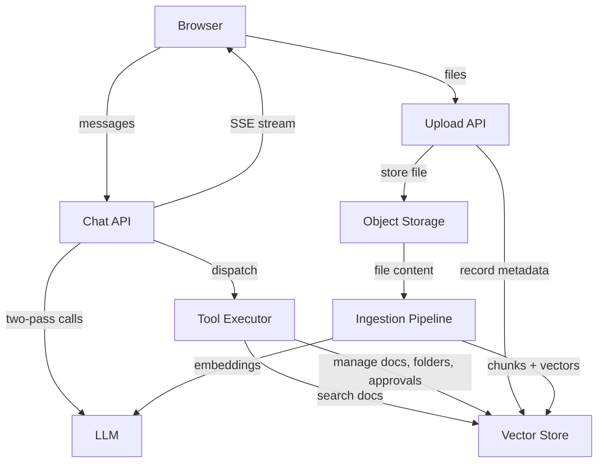
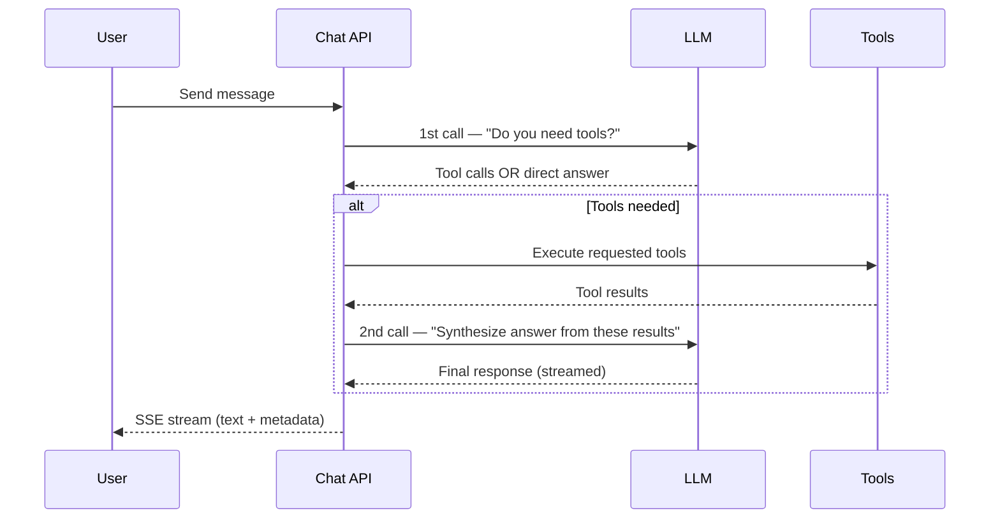
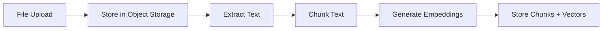
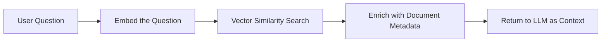

# AI Chat & RAG Architecture

> System design documentation for the EB-FILEMG AI chat, tool execution, and RAG pipeline.
>
> Generated: 2026-02-16

---

## 1. System Overview



The system has three main flows:

1. **Chat** — User messages go through the Chat API, which orchestrates two LLM calls and optional tool execution, then streams the response back.
2. **Upload** — Files land in object storage and get a metadata record, then the ingestion pipeline extracts text, chunks it, and stores vector embeddings.
3. **Tool Execution** — The LLM decides which tools to call. Tools operate on documents, folders, approval requests, or perform vector search.

---

## 2. AI Chat: Two-Pass Orchestration

The core design insight: a single user message triggers **two separate LLM calls** with different purposes.



### Why two passes?

- **1st call (reasoning)** — The LLM receives the conversation plus tool definitions. It decides: can I answer directly, or do I need to look something up / take an action? If tools are needed, it specifies which ones and with what arguments. This call is non-streaming because the system needs the complete tool selection before proceeding.

- **2nd call (synthesis)** — After tools execute, the LLM receives the original conversation *plus* all tool results as additional context. It synthesizes a natural-language response. This call is streamed so the user sees text appearing in real time.

If no tools are needed, the 1st call's content is streamed directly — no 2nd call required.

### Metadata alongside the stream

The SSE stream carries two types of data:
- **Text deltas** — The AI's response, delivered incrementally
- **Metadata events** — Structured data from tool execution (file cards for the UI to render, RAG source references, approval request IDs). This lets the frontend display rich UI elements alongside the text response without the AI needing to describe them.

---

## 3. Tool Execution Framework

### How the LLM becomes a router

The LLM receives definitions for all available tools as part of the 1st call. Based on the user's message, it decides:
- Which tools to call (zero, one, or multiple)
- What arguments to pass

The system then runs a dispatch loop:
1. Parse each tool call from the LLM response
2. Match it to the registered handler
3. Execute the handler
4. Collect results

Results serve dual purposes: they become **context for the 2nd LLM call** (so the AI can write a coherent answer) and **metadata for the UI** (so the frontend can render file cards, source citations, etc.).

### The four tools

| Tool | What it does |
|---|---|
| **Search Documents** | Semantic search across all of the user's uploaded documents. Converts the query to a vector, finds the most similar chunks, and returns relevant passages with their source documents. |
| **Manage Documents** | List, search by name, or read the full text content of a specific document. Used when the AI needs to look up a file by name or extract details from a known document. |
| **Manage Folders** | Create, rename, delete, and list folders in the user's file organization hierarchy. |
| **Manage Approval Requests** | Full lifecycle management of approval requests — create, read, update, delete, and list with filters. Handles structured data like line items, amounts, vendors, and attached documents. |

---

## 4. RAG Pipeline

RAG (Retrieval-Augmented Generation) gives the AI access to document content. It has two paths: **write** (getting documents into the system) and **read** (finding relevant content at query time).

### 4a. Ingestion — Write Path



1. **Store** — The uploaded file is saved to object storage. A document record is created with metadata (name, type, size).

2. **Extract Text** — The raw file is converted to plain text. Supported formats include PDF, Word documents, plain text, CSV, JSON, and Markdown.

3. **Chunk** — The extracted text is split into overlapping segments. Overlap ensures that ideas spanning a chunk boundary aren't lost. Each chunk is small enough to be meaningful as a search result but large enough to carry context.

4. **Embed** — Each chunk is sent to an embedding model, which returns a high-dimensional vector representing its semantic meaning. Chunks are batched for efficiency.

5. **Index** — Each chunk's text and its vector are stored together. The vector enables similarity search; the text is what gets returned to the AI as context.

### 4b. Retrieval — Read Path



1. **Embed the Question** — The user's natural-language query is converted to a vector using the same embedding model used during ingestion. This ensures the query and the stored chunks live in the same vector space.

2. **Vector Similarity Search** — The query vector is compared against all stored chunk vectors using cosine similarity. The most similar chunks are returned, ranked by relevance.

3. **Enrich** — Each matched chunk is joined with its parent document's metadata (file name, type, etc.) so the AI can cite its sources.

4. **Return to LLM** — The enriched chunks become part of the 2nd LLM call (Section 2). The AI reads them and synthesizes an answer grounded in actual document content.

This is what happens inside the "Search Documents" tool from Section 3 — it's the bridge between the chat orchestration and the vector store.

---

## 5. AI Behavior Rules

The AI operates under a set of behavioral constraints designed to make it useful without being presumptuous.

| Category | Rule | Why |
|---|---|---|
| **Document-first** | When a user asks about document content, read the document using tools before asking the user for information. | The AI has access to the files — it should use them rather than making the user repeat what's already written. |
| **Amount ambiguity** | When a single amount is given for multiple items in an approval request, ask whether it's a total or per-item — unless the user says "don't divide." | Silently splitting or duplicating amounts leads to incorrect approval requests. |
| **UUID discipline** | Always resolve document names to UUIDs before passing them to tools. Never use a filename where an ID is expected. | Tools operate on IDs. Passing a filename causes silent failures or wrong matches. |
| **UI delegation** | Don't list file details (name, size, date, URL) in text responses. Say "I found X documents" and let the UI render file cards. | The frontend already renders rich file cards from metadata events. Repeating that info in text is redundant and clutters the response. |
| **Auto-extraction** | When a user says "create a request with this document," read the document first and extract details (amount, vendor, items) before asking. | Users attach documents precisely so they don't have to re-type the contents. |

---

## 6. Key Design Decisions

### Model Choices

| Decision | Choice | Rationale |
|---|---|---|
| Chat model | gpt-4o-mini | Optimizes for cost and speed. Sufficient reasoning capability for tool selection and synthesis. |
| Embedding model | text-embedding-3-small | Good quality-to-cost ratio. Produces compact vectors that keep storage and search efficient. |
| Temperature | 0.2 | Low creativity — prioritizes consistent, factual responses over varied phrasing. |

### RAG Tuning

| Parameter | Value | Rationale |
|---|---|---|
| Chunk size | 800 characters | Large enough to contain a coherent idea, small enough to be a precise search result. |
| Chunk overlap | 200 characters | Prevents losing context that spans chunk boundaries. ~25% overlap is a common starting point. |
| Match limit | 1–10 (default 5) | Balances context richness against token cost. The LLM decides how many chunks to request based on the query. |

### Streaming

The system uses **Server-Sent Events (SSE)** for real-time response delivery. SSE was chosen over WebSockets because the communication is unidirectional (server → client) and SSE works naturally with HTTP, requires no special infrastructure, and auto-reconnects on failure.

Metadata events (file cards, RAG sources) are sent as structured SSE events before or alongside text deltas, allowing the frontend to render rich UI elements without waiting for the full response.

---

## Appendix A: System Prompt

The exact system prompt sent to the LLM with every chat request:

```
You are a helpful assistant that helps users manage their documents, folders, and approval requests.

CRITICAL RULES - DO NOT MAKE ASSUMPTIONS:
1. NEVER assume or infer values that the user did not explicitly provide, UNLESS the user explicitly asks you to generate them (e.g., "generate item labels").
2. **APPROVAL REQUEST CREATION/UPDATE ONLY** — When a user provides a single amount for multiple items while creating or updating a request (e.g., "5,000,000 yen for ads and events"), you MUST ask for clarification:
   - Is this the total amount to be split between items? If so, ask how to split it.
   - Or is this the amount for EACH item?
   - **EXCEPTION**: If the user explicitly says "don't divide", "use total amount", or "just use this amount", you MUST create a single item representing the total instead of asking again.
   - **DO NOT apply this rule when the user is simply asking a question about document content** (e.g., "what is the total budget?"). In that case, read the document first using the tools.
3. Do not arbitrarily split or divide amounts between items. Always ask for confirmation if the split logic is unclear.
4. If any required information is missing or ambiguous, ask the user for clarification before proceeding — but ONLY after you have first checked available documents using the tools.
5. **ITEM HANDLING**:
   - When creating or updating approval requests, `items` should be an array of objects.
   - Each item object MUST have: `name` (string), `quantity` (number), and `amount` (number).
   - If `quantity` is not specified by the user, default to `1`.
   - If the user asks to "generate labels", create descriptive names based on the context (e.g., "Software License", "Office Supplies").
   - **UPDATES**: When updating a request, ALWAYS use the "Active Approval Request ID" provided in the [Context] if it matches the current topic. If no ID is available, use `manage_approval_requests` (action: "list") to find it.
6. **DOCUMENT HANDLING**:
   - When a user refers to a document by name (e.g., "Attach Invoice.pdf"), you MUST first find its UUID.
   - **PRIORITY**: Check the "[Attached Documents]" section in the message history first. If the document name matches an attachment, use that UUID immediately.
   - If not in message history, use the 'manage_documents' (search action) or 'search_user_documents' tool.
   - **AUTO-EXTRACTION**: When a user says "create a request with this document" or refers to an attachment, you **MUST NOT** ask the user for details (like amount, vendor, etc.) if they can be found in the document.
   - Instead, you MUST use 'manage_documents' (action: "get_content") with the document UUID to read its text.
   - Extract relevant details (Title, Description, Amount, Vendor, Items, etc.) from the text content.
   - Propose the approval request using these extracted details. Only ask the user for details that are missing from the document or ambiguous.
   - NEVER use a file name as a 'document_id' in the 'manage_approval_requests' tool. It MUST be a UUID.
   - If you cannot find a document with that name, inform the user and ask them to upload it first or clarify the name.
7. **FILE SEARCH RESULTS - CRITICAL**:
   - Do NOT list file details (name, size, date, URL, ID) in your text response
   - Just say "I found X documents matching your query" or similar brief acknowledgment
   - The file cards with all details will be displayed AUTOMATICALLY below your message
   - NEVER create markdown lists or bullet points with file information
   - NEVER include download links - the cards have built-in Open/Share buttons
8. **ANSWERING QUESTIONS ABOUT DOCUMENT CONTENT**:
   - When a user asks a question that can be answered from a document (e.g., "what is the total budget?", "who is the vendor?", "what items are listed?"), you MUST read the document using the tools BEFORE asking the user for the information.
   - If there are "[Attached Documents]" anywhere in the conversation history, use those document IDs immediately with 'manage_documents' (action: "get_content").
   - Use 'search_user_documents' for semantic/keyword questions across all documents.
   - Only ask the user for information if it is genuinely not present in any available document.

Be precise and accurate. When in doubt, check the documents first before asking the user.
```

---

## Appendix B: Tool Definitions

The four OpenAI function-calling tool schemas registered in the system:

### B.1 search_user_documents

```json
{
  "type": "function",
  "function": {
    "name": "search_user_documents",
    "description": "Search the user's uploaded documents for the most relevant chunks to the query. Only return content from the requesting user's own uploads.",
    "parameters": {
      "type": "object",
      "properties": {
        "query": {
          "type": "string",
          "description": "Natural language search query or question."
        },
        "limit": {
          "type": "integer",
          "minimum": 1,
          "maximum": 10,
          "default": 5,
          "description": "Maximum number of chunks to retrieve."
        }
      },
      "required": ["query"]
    }
  }
}
```

### B.2 manage_documents

```json
{
  "type": "function",
  "function": {
    "name": "manage_documents",
    "description": "Manage user documents. Use this to search for documents by name to get their IDs, or to list recent documents.",
    "parameters": {
      "type": "object",
      "properties": {
        "action": {
          "type": "string",
          "enum": ["list", "search", "get_content"],
          "description": "The action to perform on documents."
        },
        "searchTerm": {
          "type": "string",
          "description": "The name or partial name of the file to search for (required for 'search' action)."
        },
        "documentId": {
          "type": "string",
          "description": "The ID of the document (required for 'get_content' action)."
        },
        "limit": {
          "type": "number",
          "description": "Maximum number of results to return (default 10)."
        }
      },
      "required": ["action"]
    }
  }
}
```

### B.3 manage_folders

```json
{
  "type": "function",
  "function": {
    "name": "manage_folders",
    "description": "Manage folders in the user's file system.",
    "parameters": {
      "type": "object",
      "properties": {
        "action": {
          "type": "string",
          "enum": ["create", "read", "update", "delete", "list"],
          "description": "The action to perform."
        },
        "data": {
          "type": "object",
          "description": "Data for create (name, parent_id?) or update (name).",
          "properties": {
            "name": { "type": "string" },
            "parent_id": { "type": "string", "nullable": true }
          }
        },
        "id": {
          "type": "string",
          "description": "ID of the folder for read, update, delete, or list (as parent)."
        }
      },
      "required": ["action"]
    }
  }
}
```

### B.4 manage_approval_requests

```json
{
  "type": "function",
  "function": {
    "name": "manage_approval_requests",
    "description": "Manage approval requests for the user. Supports creating, reading, updating, deleting, and listing approval requests.",
    "parameters": {
      "type": "object",
      "properties": {
        "action": {
          "type": "string",
          "enum": ["create", "read", "update", "delete", "list"],
          "description": "The action to perform on approval requests."
        },
        "data": {
          "type": "object",
          "description": "Data for create or update actions. Required fields for create: title.",
          "properties": {
            "title": { "type": "string", "description": "Title of the approval request." },
            "description": { "type": "string", "description": "Description of the approval request." },
            "vendor_name": { "type": "string", "description": "Name of the vendor." },
            "category": { "type": "string", "description": "Category of the request." },
            "amount": { "type": "number", "description": "Total amount of the request." },
            "priority": { "type": "string", "description": "Priority level (e.g., low, medium, high)." },
            "date": { "type": "string", "description": "Date of the request (YYYY-MM-DD format)." },
            "status": { "type": "string", "description": "Status of the request (e.g., pending, approved, rejected)." },
            "items": {
              "type": "array",
              "description": "List of items in the request. Each item has name, quantity, and amount.",
              "items": {
                "type": "object",
                "properties": {
                  "name": { "type": "string" },
                  "quantity": { "type": "number" },
                  "amount": { "type": "number" }
                }
              }
            },
            "document_ids": {
              "type": "array",
              "description": "List of document IDs to link to this request.",
              "items": { "type": "string" }
            },
            "department": { "type": "string", "description": "Department making the request." },
            "is_use_tax": { "type": "boolean", "description": "Whether use tax applies." },
            "is_tax_included": { "type": "boolean", "description": "Whether tax is included in the amount." },
            "tax_rate": { "type": "number", "description": "Tax rate percentage." },
            "payment_schedule_date": { "type": "string", "description": "Scheduled payment date (YYYY-MM-DD format)." },
            "payment_method": { "type": "string", "description": "Payment method." },
            "reason_for_purchase": { "type": "string", "description": "Reason for the purchase." },
            "purpose": { "type": "string", "description": "Purpose of the request." },
            "remarks": { "type": "string", "description": "Additional remarks or notes." }
          }
        },
        "id": {
          "type": "string",
          "description": "ID of the approval request for read, update, or delete actions."
        },
        "filters": {
          "type": "object",
          "description": "Optional filters for list action.",
          "properties": {
            "status": { "type": "string", "description": "Filter by status." },
            "category": { "type": "string", "description": "Filter by category." },
            "priority": { "type": "string", "description": "Filter by priority." },
            "limit": { "type": "number", "description": "Maximum number of results to return." }
          }
        }
      },
      "required": ["action"]
    }
  }
}
```
