# RAG Architecture Research - EB-FILEMG

Deep research into the current Retrieval-Augmented Generation (RAG) architecture, embedding strategy, retrieval strategy, and approval integration in the EB-FILEMG project.

---

## High-Level Flows

### How a File Becomes Searchable

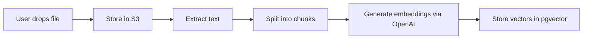

### How a User Searches Documents


### How an Approval Request is Created from a Document

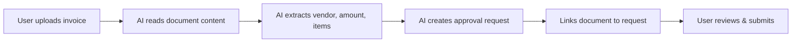

### Overall System Flow

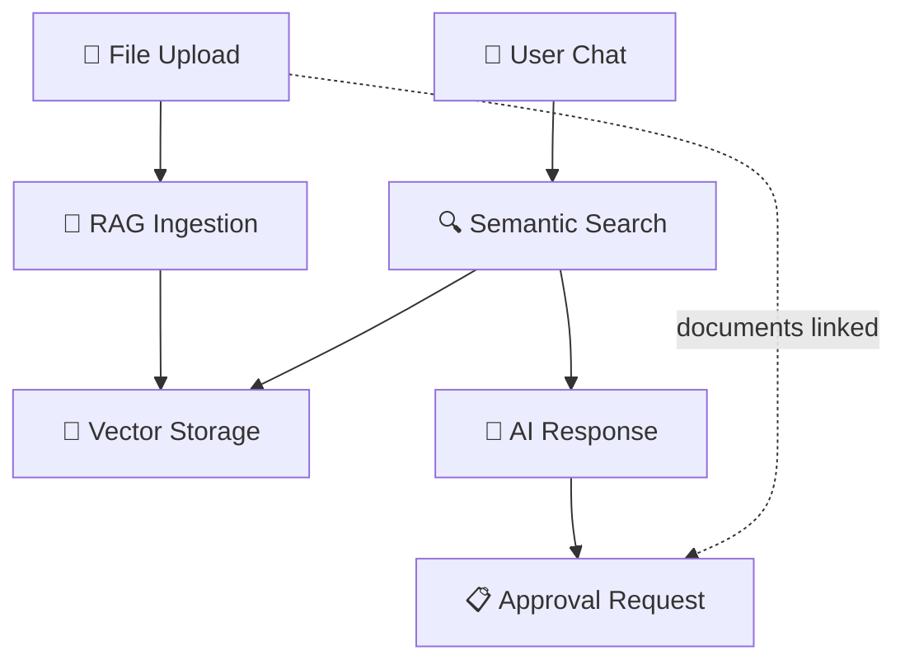

---

## 1. System Overview

The RAG system enables intelligent document search by ingesting uploaded files, generating vector embeddings, and retrieving relevant content during AI conversations.

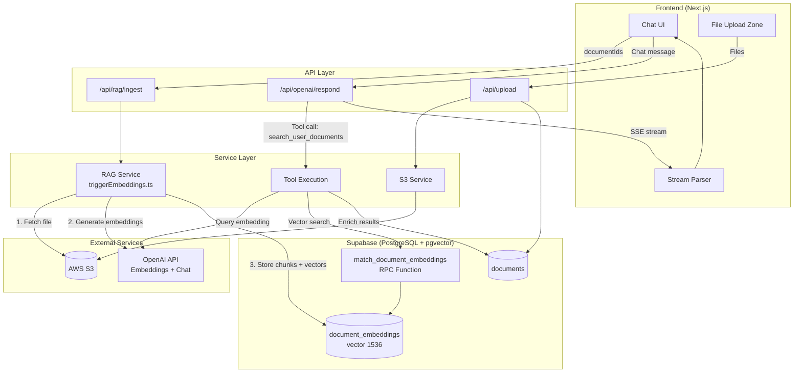

---

## 2. Database Schema

### Entity Relationship Diagram

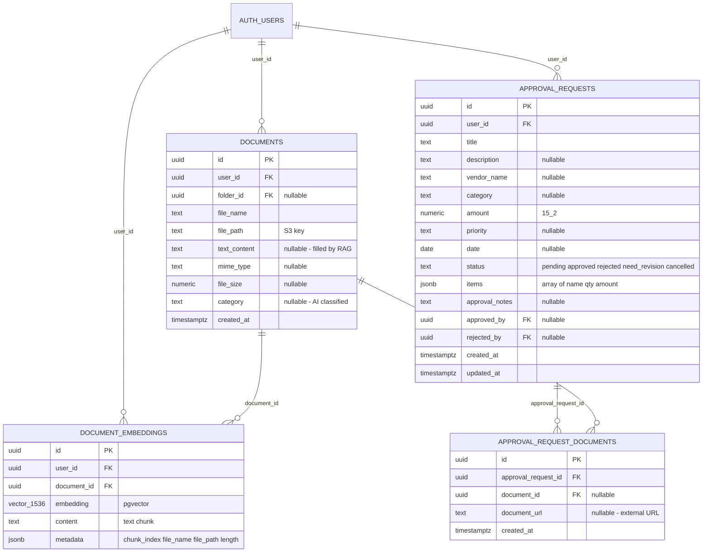

### Vector Search Function

The `match_document_embeddings` RPC function performs cosine similarity search:

```sql
CREATE OR REPLACE FUNCTION public.match_document_embeddings(
  query_embedding vector(1536),
  match_count int DEFAULT 5,
  similarity_threshold float DEFAULT 0.5
)
RETURNS TABLE (
  id uuid, user_id uuid, document_id uuid,
  embedding vector(1536), content text,
  metadata jsonb, similarity float
)
LANGUAGE plpgsql AS $$
BEGIN
  RETURN QUERY
  SELECT de.id, de.user_id, de.document_id,
         de.embedding, de.content, de.metadata,
         1 - (de.embedding <=> query_embedding) AS similarity
  FROM public.document_embeddings de
  WHERE de.user_id = auth.uid()
  ORDER BY de.embedding <=> query_embedding
  LIMIT match_count;
END;
$$;
```

**Key details**:
- Uses `<=>` cosine distance operator (pgvector)
- Similarity = `1 - cosine_distance` (higher = more similar)
- RLS enforced: `de.user_id = auth.uid()` - users only search their own embeddings
- Default threshold: 0.5, default limit: 5

---

## 3. Embedding Strategy

### Text Extraction

Files are fetched from S3 and text is extracted based on MIME type:

| Format | Library | Notes |
|--------|---------|-------|
| PDF | `pdf-parse` | Extracts all text from pages |
| DOCX | `mammoth` | Extracts raw text |
| Google Docs | Custom JSON parser | Parses export JSON structure |
| TXT, MD, CSV, JSON | UTF-8 decode | Direct string conversion |
| Other text-like | UTF-8 fallback | Attempts decode |
| Unsupported | Skipped | Returns empty string |

### Text Normalization

```typescript
const normalizeText = (content: string) =>
  content.replace(/\s+/g, " ").replace(/\n+/g, " ").trim();
```

Collapses all whitespace and newlines into single spaces.

### Chunking Strategy

```
Chunk Size:  800 characters
Overlap:     200 characters (25%)
```

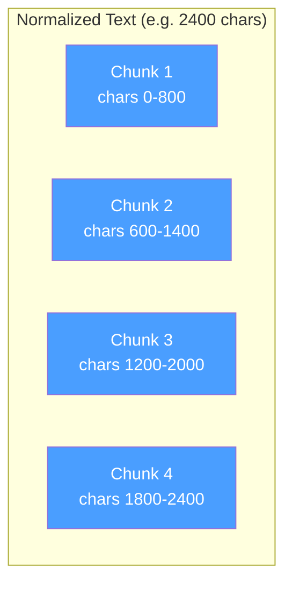

- Sliding window: advances by `chunkSize - overlap` = 600 chars per step
- 200-char overlap ensures semantic continuity between chunks
- Prevents sentence/concept splitting at boundaries

### Embedding Generation

| Parameter | Value |
|-----------|-------|
| Model | `text-embedding-3-small` (configurable via `OPENAI_EMBEDDING_MODEL`) |
| Dimensions | 1536 |
| Batch size | 80 chunks per API request |
| API endpoint | `{OPENAI_BASE_URL}/embeddings` |

Chunks are sent in batches of 80 to stay under OpenAI rate limits. Each chunk produces a 1536-dimensional float vector.

### Metadata Stored Per Chunk

```json
{
  "chunk_index": 0,
  "file_name": "invoice-2025.pdf",
  "file_path": "uploads/user-id/1707123456_invoice-2025.pdf",
  "length": 782
}
```

---

## 4. Ingestion Pipeline

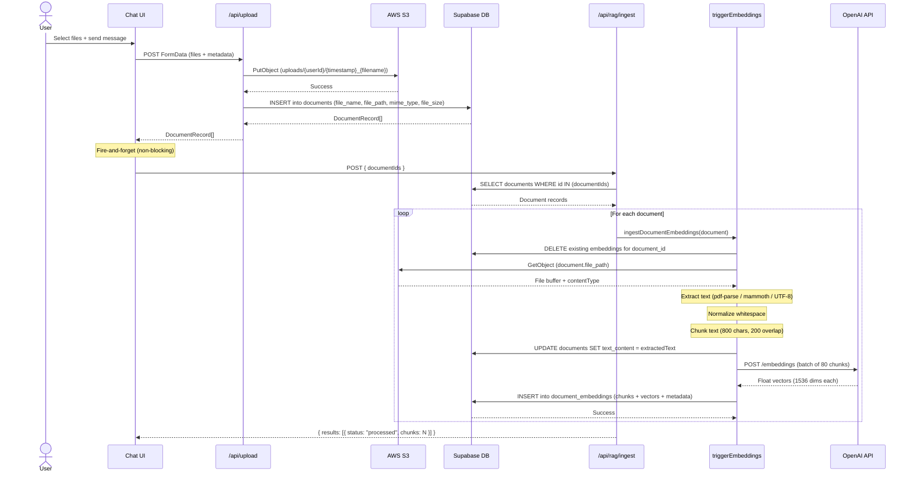

### Ingestion Result Types

```typescript
type IngestionResult =
  | { documentId: string; status: "processed"; chunks: number }
  | { documentId: string; status: "skipped"; reason: string }  // unsupported format
  | { documentId: string; status: "failed"; reason: string };  // error occurred
```

### Error Handling

- **Unsupported format**: Skipped with reason (non-fatal)
- **Empty text extraction**: Skipped (non-fatal)
- **OpenAI API error**: Failed with error message
- **DB write error**: Failed with error message
- **Entire ingestion failure**: Doesn't block file upload or chat

---

## 5. Retrieval Strategy

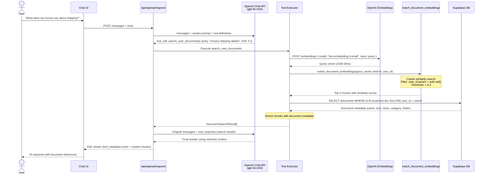

### Search Tool Definition

```typescript
{
  name: "search_user_documents",
  description: "Search the user's uploaded documents for the most relevant chunks.",
  parameters: {
    query: { type: "string", description: "Natural language search query" },
    limit: { type: "integer", minimum: 1, maximum: 10, default: 5 }
  },
  required: ["query"]
}
```

### Return Type

```typescript
type DocumentSearchResult = {
  documentId: string;
  similarity: number | null;     // 0.0 to 1.0 (cosine)
  content: string;               // The matched text chunk
  file: DocumentMetadata | null; // Enriched file info
};

type DocumentMetadata = {
  id: string;
  name: string;
  mimeType: string;
  size: number;
  fileUrl: string;        // S3 key for presigned URL
  modifiedTime: string;
  category?: string | null;
  folderId?: string;
};
```

### Fallback Strategy

If vector search fails (e.g., RPC error), the system falls back to a basic table scan:

```typescript
const { data: fallback } = await supabase
  .from("document_embeddings")
  .select("document_id, content, metadata")
  .eq("user_id", userId)
  .limit(limit);
```

This returns recent chunks without similarity scoring.

---

## 6. AI Tool Integration

### Tool Registry

The OpenAI chat endpoint registers 4 tools:

| Tool | File | Purpose |
|------|------|---------|
| `search_user_documents` | `tools/rag.ts` | Vector similarity search across documents |
| `manage_documents` | `tools/documents.ts` | List, search by name, get content |
| `manage_folders` | `tools/folders.ts` | Folder CRUD operations |
| `manage_approval_requests` | `tools/approval-requests.ts` | Approval request CRUD |

### Chat Flow with Tool Calling

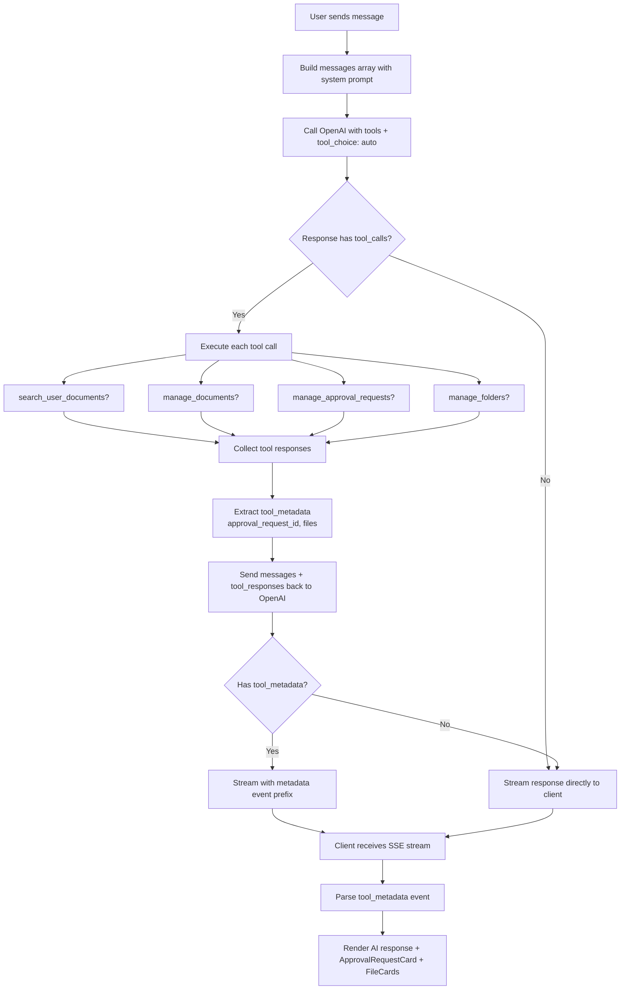

### Streaming Response Format

```
event: tool_metadata
data: {"type":"tool_metadata","approval_request_id":"uuid","files":[...],"rag_sources":[...]}

data: {"choices":[{"delta":{"content":"Based on your invoice..."}}]}
data: {"choices":[{"delta":{"content":" the shipping cost is..."}}]}
data: [DONE]
```

- `files`: All documents referenced by tool responses (manage_documents + RAG)
- `rag_sources`: Documents specifically returned by `search_user_documents` (used for "Sources:" display in Q&A)
- `approval_request_id`: UUID of a newly created approval request

### Tool Error Handling

Unknown tools and unparseable arguments now return structured error responses to OpenAI instead of being silently skipped, allowing the model to recover gracefully.

---

## 7. Approval Request Flow

### Status State Machine

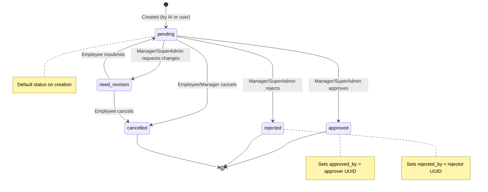

### Role-Based Permissions

| Role | Allowed Status Changes |
|------|----------------------|
| Manager / SuperAdmin | `approved`, `rejected`, `need_revision`, `cancelled` |
| Employee | `pending`, `cancelled` |
| Accountant | **No permission** |

### Document-Approval Linkage

Approval requests link to documents via the `approval_request_documents` junction table:

- `document_id` (nullable): Internal document stored in S3
- `document_url` (nullable): External URL reference
- On document delete: `document_id` set to NULL (soft reference preserved)

### AI-Created Approval Requests

When the AI creates an approval request via the `manage_approval_requests` tool:

1. AI extracts metadata from uploaded documents (vendor, amount, items, etc.)
2. Creates approval request via tool call
3. Links uploaded documents to the request
4. Returns `approval_request_id` in tool metadata
5. Frontend renders `ApprovalRequestCard` component with the ID

---

## 8. End-to-End Flow

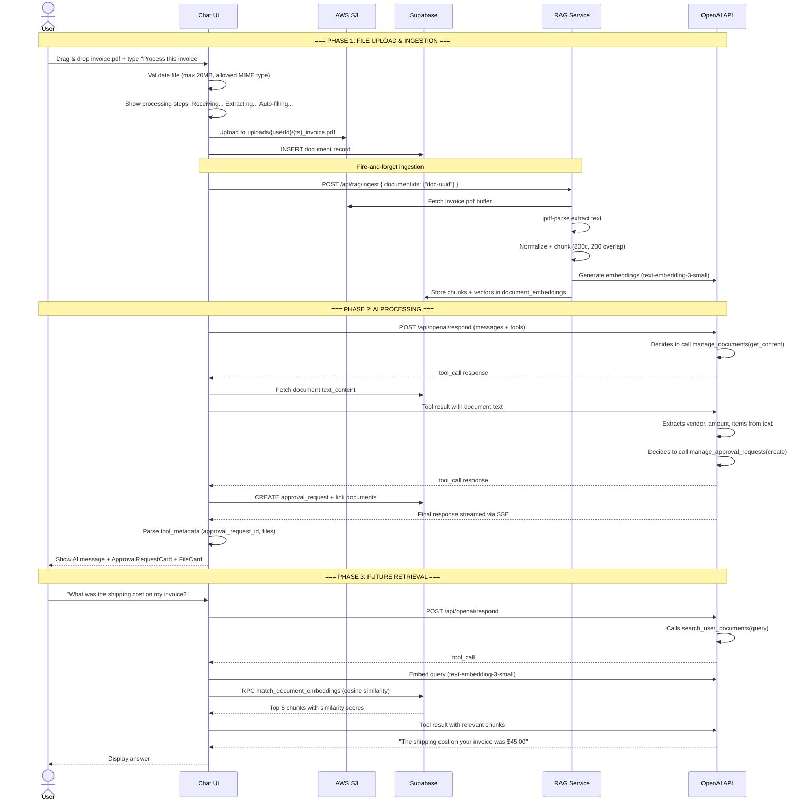

---

## 9. Configuration & Constants

### Environment Variables

| Variable | Purpose | Default |
|----------|---------|---------|
| `OPENAI_API_KEY` | OpenAI API authentication | (required) |
| `OPENAI_BASE_URL` | OpenAI API base URL | `https://api.openai.com/v1` |
| `OPENAI_EMBEDDING_MODEL` | Embedding model name | `text-embedding-3-small` |
| `OPENAI_MODEL` | Chat model name | `gpt-4o-mini` |
| `AWS_S3_BUCKET` | S3 bucket for file storage | (required) |
| `AWS_REGION` | AWS region | (required) |
| `AWS_ACCESS_KEY_ID` | AWS credentials | (required) |
| `AWS_SECRET_ACCESS_KEY` | AWS credentials | (required) |

### Hardcoded Constants

| Parameter | Value | Location |
|-----------|-------|----------|
| Chunk size | 800 chars | `triggerEmbeddings.ts` |
| Chunk overlap | 200 chars | `triggerEmbeddings.ts` |
| Embedding dimensions | 1536 | DB schema + API |
| Embedding batch size | 80 | `triggerEmbeddings.ts` |
| Default match count | 5 | `match_document_embeddings` SQL |
| Similarity threshold | 0.5 | `match_document_embeddings` SQL |
| Max search limit (client) | 10 | `rag.ts` tool definition |
| Max file size | 20MB | `ThreadPageClient.tsx` |
| Max tokens | 2048 | `respond/route.ts` |
| Chat temperature | 0.2 | `respond/route.ts` |

### Security

- **RLS (Row-Level Security)**: All tables enforce `user_id = auth.uid()`
- **Bearer token auth**: Upload and ingest endpoints validate access tokens
- **Data isolation**: Vector search function filters by authenticated user
- **S3 path isolation**: Files stored under `uploads/{userId}/`

---

## 10. Key Files Reference

### RAG Pipeline

| File | Purpose |
|------|---------|
| `src/service/rag/triggerEmbeddings.ts` | Core: text extraction, chunking, embedding generation, DB storage |
| `src/service/rag/ingestDocuments.ts` | Client-side API wrapper for ingestion |
| `src/app/api/rag/ingest/route.ts` | API endpoint for RAG ingestion |

### AI & Retrieval

| File | Purpose |
|------|---------|
| `src/app/api/openai/respond/route.ts` | Main chat API with tool calling + streaming |
| `src/app/api/openai/respond/tools/rag.ts` | Vector search tool (`search_user_documents`) |
| `src/app/api/openai/respond/tools/documents.ts` | Document management tool |
| `src/app/api/openai/respond/tools/approval-requests.ts` | Approval request tool |
| `src/app/api/openai/respond/tools/index.ts` | Tool registry |
| `src/app/api/openai/respond/utils/tool-execution.ts` | Tool call executor |
| `src/app/api/openai/respond/utils/stream.ts` | SSE streaming with metadata |

### Upload & Storage

| File | Purpose |
|------|---------|
| `src/app/api/upload/route.ts` | File upload endpoint |
| `src/service/s3/uploadFile.ts` | S3 PutObject server action |
| `src/service/s3/upload.ts` | Client upload service |
| `src/service/s3/s3Presign.ts` | Presigned URL generation |

### Frontend Integration

| File | Purpose |
|------|---------|
| `src/components/chat/hooks/useThreadWorkspace.ts` | Upload + chat orchestration |
| `src/hooks/chat/useAssistantStream.ts` | SSE stream parsing + metadata extraction |
| `src/components/chat/ThreadPageClient.tsx` | Main chat UI component |

### Database

| File | Purpose |
|------|---------|
| `supabase/migrations/20250218120000_create_documents_table.sql` | Documents table |
| `supabase/migrations/20250218121000_create_document_embeddings_table.sql` | Embeddings table with pgvector |
| `supabase/migrations/20250218133000_simplify_match_document_embeddings_function.sql` | Vector search RPC |
| `supabase/migrations/20251223205500_create_approval_requests_table.sql` | Approval requests |
| `supabase/migrations/20251229000000_add_approval_request_documents_table.sql` | Document-approval junction |

### Types

| File | Purpose |
|------|---------|
| `src/types/document.ts` | DocumentRecord, DocumentMetadata, DocumentSearchResult |
| `src/types/approvalRequest.ts` | ApprovalRequest, ApprovalRequestItem, ApprovalRequestDocument |

---

## 11. Loopholes, Bugs & Improvement Ideas

Deep code audit findings across the RAG, approval, upload, and retrieval flows. Grouped by category with severity tags for prioritization.

### 11.1 Security Issues

| # | Finding | Severity | File | Issue | Scenario |
|---|---------|----------|------|-------|----------|
| S1 | Self-approval loophole | **CRITICAL** | `approvalRequest.ts` | No `user_id != approver` check — a manager can approve their own request | Manager submits ¥500k expense, approves it themselves |
| S2 | Thread ownership not verified | **HIGH** | `respond/route.ts:77-91` | Thread existence is checked but not user ownership — any authenticated user can access another user's conversation by knowing the thread ID | User A guesses/leaks thread UUID, reads User B's chat history |
| S3 | No defense-in-depth on ingest | **HIGH** | `ingest/route.ts:51-69` | `documentIds` are not verified against `user_id` — relies solely on RLS | Attacker sends another user's document IDs to re-ingest or overwrite embeddings |
| S4 | RLS blocks manager approvals | **HIGH** | `migration: approval_requests` | UPDATE RLS policy only allows `user_id = auth.uid()` — managers can't approve other employees' requests at DB level | Manager tries to approve an employee's request → silently blocked by RLS |

### 11.2 Data Integrity Issues

| # | Finding | Severity | File | Issue | Scenario |
|---|---------|----------|------|-------|----------|
| D1 | Status regression | **HIGH** | `approvalRequest.ts` | No guard against reverting final states (e.g., `approved` → `pending`) | API call reverts an already-approved request back to pending |
| D2 | Conflicting approver/rejector | **HIGH** | `approvalRequest.ts:632-638` | Both `approved_by` and `rejected_by` can be non-null simultaneously | Request approved, then status changed to rejected without clearing `approved_by` |
| D3 | Embeddings deleted then skipped | **HIGH** | `triggerEmbeddings.ts:218-250` | Existing embeddings are deleted BEFORE checking if new text extraction succeeds — if extraction fails, document loses all searchability | Re-ingest a DOCX that was moved from S3 → old embeddings gone, new ones never created |
| D4 | Orphaned S3 files | **HIGH** | `upload/route.ts:64-102` | S3 upload succeeds → DB insert fails → file is stuck in S3 with no database record | DB timeout during upload → file exists in S3 but no document row references it |
| D5 | Embedding-chunk index mismatch | **MEDIUM** | `triggerEmbeddings.ts:263-280` | If OpenAI returns fewer embeddings than chunks sent, embeddings are stored against wrong chunk indices | Partial OpenAI response → chunk 3's text paired with chunk 1's embedding |

### 11.3 Validation Gaps

| # | Finding | Severity | File | Issue | Scenario |
|---|---------|----------|------|-------|----------|
| V1 | No item amount/quantity validation | **HIGH** | `approvalRequest.ts:213-224` | Negative amounts, zero quantities, non-numeric values all accepted | AI creates item with `quantity: -5, amount: NaN` → stored in DB |
| V2 | No approval amount validation | **HIGH** | `approvalRequest.ts:249` | Negative, `NaN`, `Infinity` accepted as total amount | Approval request with `amount: -99999` passes all checks |
| V3 | No file size limit (server) | **HIGH** | `upload/route.ts` | Client enforces 20MB limit but server has none | Direct API call with 500MB file bypasses client check, fills S3 |
| V4 | Zero-byte files accepted | **MEDIUM** | `upload/route.ts:70` | Empty files are uploaded, stored, and sent to ingestion | User drops empty file → uploaded to S3, document row created, ingestion returns "skipped" |
| V5 | Document URLs not validated | **MEDIUM** | `approvalRequest.ts:289-296` | Arbitrary strings stored as `document_url` (could be `javascript:` or data URIs) | AI stores `javascript:alert(1)` as document URL → rendered as link in UI |
| V6 | No items array limit | **MEDIUM** | `approvalRequest.ts` | Approval request can contain unlimited items | AI or API call creates request with 100,000 line items → DB bloat, UI freeze |

### 11.4 File Processing Gaps

| # | Finding | Severity | File | Issue | Scenario |
|---|---------|----------|------|-------|----------|
| F1 | Images silently unsearchable | **MEDIUM** | `triggerEmbeddings.ts:63-143` | JPG/PNG/HEIC upload succeeds but text extraction returns empty → no embeddings → invisible to search | User uploads beach photo receipt, asks "find my receipt" → nothing found |
| F2 | Excel/PowerPoint unsupported | **MEDIUM** | `triggerEmbeddings.ts` | XLSX, PPTX accepted at upload but produce no embeddings | User uploads quarterly spreadsheet → uploaded but never searchable |
| F3 | Scanned PDFs (image-only) | **MEDIUM** | `triggerEmbeddings.ts` | `pdf-parse` returns empty text for image-only PDFs → no OCR pipeline | Scanned contract uploaded → stored but zero search results |
| F4 | Text normalization destroys structure | **MEDIUM** | `triggerEmbeddings.ts:145-146` | All newlines collapsed into single spaces → code blocks, tables, and lists lose structural meaning | CSV file with columns → becomes unreadable single line of text in embeddings |

### 11.5 Retrieval Limitations

| # | Finding | Severity | File | Issue | Scenario |
|---|---------|----------|------|-------|----------|
| R1 | Hardcoded similarity threshold | **MEDIUM** | `rag.ts:56-65` | Threshold `0.5` is not configurable from client or environment | Niche domain vocabulary consistently scores 0.45 → never returned |
| R2 | Fallback only at 0 results | **MEDIUM** | `rag.ts:59-128` | If vector search returns 2 of 5 requested, no fallback attempted for remaining 3 | Query matches 2 chunks above threshold, misses 3 relevant ones just below |
| R3 | Single tool-call depth (by design) | **LOW** | `respond/route.ts:160-170` | Follow-up call uses `tool_choice: "none"` — intentionally prevents recursive tool calls. If AI needs a second tool, it must be done in a separate user turn | AI searches docs, wants to also create approval request → must happen in next message |
| R4 | No duplicate chunk prevention | **LOW** | `triggerEmbeddings.ts:148-168` | Short texts (600–800 chars) produce overlapping duplicate chunks with near-identical content | 700-char document → 2 chunks that are 87% identical → search returns same content twice |

### 11.6 Concurrency & UX Issues

| # | Finding | Severity | File | Issue | Scenario |
|---|---------|----------|------|-------|----------|
| C1 | Thread creation race condition | **MEDIUM** | `useThreadWorkspace.ts:192-202` | Rapid messages can trigger concurrent `createThread` calls → duplicate threads | User double-clicks send → two threads created for same conversation |
| C2 | S3 filename collision | **MEDIUM** | `upload/route.ts:66` | S3 key uses `Date.now()` — same-millisecond uploads overwrite each other | Drag 5 files at once → some share the same millisecond → file overwritten |
| C3 | Message saved before stream completes | **MEDIUM** | `useThreadWorkspace.ts:287-292` | User message persists to DB immediately, but if AI stream fails, response is error fallback | Stream dies mid-response → user sees their message + "Sorry, error occurred" forever |
| C4 | RAG failure silent to user | **MEDIUM** | `useThreadWorkspace.ts:494-503` | Ingestion fails silently — user thinks files are searchable but they aren't | Upload 3 invoices, ingestion times out → user searches later, finds nothing, confused |
| C5 | No upload file count limit | **LOW** | `useThreadWorkspace.ts:82-84` | No limit on simultaneous file queue | User selects entire folder (1000+ files) → browser tab hangs |
| C6 | Sequential ingestion | **LOW** | `ingest/route.ts:73-79` | Documents ingested one-by-one in a loop — no parallelism | 10 documents × ~30 sec each = ~5 min total ingestion time |
